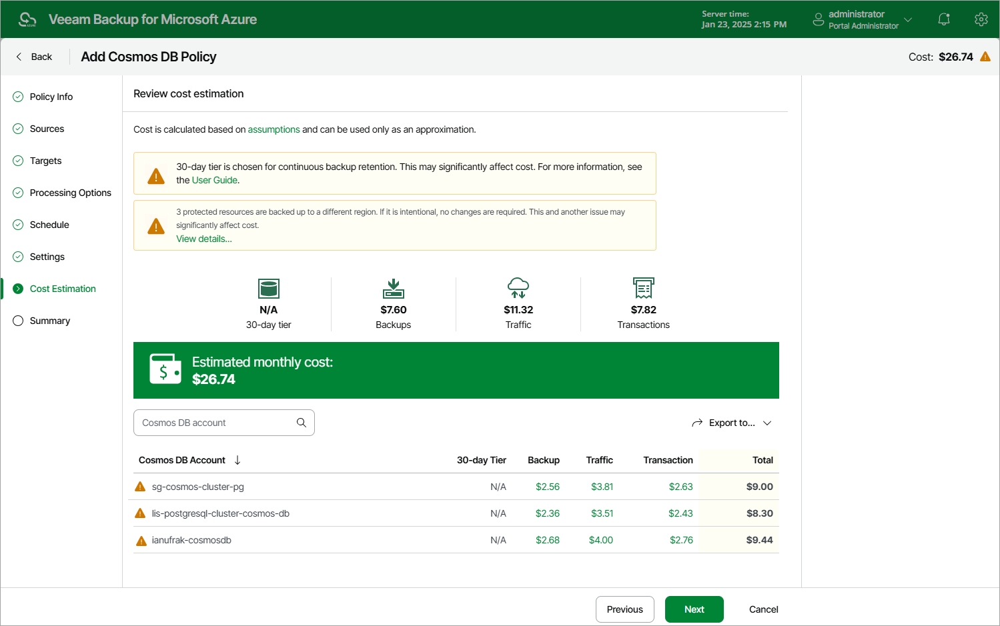

# Step 8. Review Estimated Cost

At the Cost Estimation step of the wizard, review the approximate monthly cost of Azure services that Veeam Backup for Microsoft Azure will require to protect the Cosmos DB accounts added to the backup policy. The total estimated cost includes the following:

* The cost of creating, maintaining and retaining backups of the Cosmos DB accounts.

For each Cosmos DB account included in the backup policy, the backup appliance takes into account the size of the database and the configured scheduling settings.

* The cost of transferring Cosmos DB account data between Azure regions during data protection operations (for example, if a protected Cosmos DB account and the target storage account reside in different regions).

If you get a warning message regarding additional costs associated with cross-region data transfer, you can click View details to see available cost-effective options.

* The cost of making API requests to Microsoft Azure during data protection operations.

|  |
| --- |
| Notes |
| * To calculate the estimated cost, the backup appliance uses the capabilities of the [Azure Pricing Calculator](https://azure.microsoft.com/en-us/pricing/calculator/) that estimates the cost of services in USD only. This calculator is intended for informational and estimation purposes only. * When calculating the total cost, Veeam Backup for Microsoft Azure uses an assumption that the size of each backup is the same as the size of the source data (that is, the compression ratio is 1:1). However, this does not apply to Cosmos DB for PostgreSQL backups since the size of each Cosmos DB for PostgreSQL backup depends on the type of backed-up data — as a result, the size of this backup may occur to be significantly larger than the size of the source data. The latter may increase the cost of storing backed-up data in Microsoft Azure. |

The estimated cost may occur to be significantly higher due to the backup frequency and cross-region data transfer. To reduce the cost, you can try the following workarounds:

* To avoid additional costs related to cross-region data transfer, select a repository that resides in the same region as Cosmos DB accounts that you plan to back up.

* To optimize the cost of storing backups, modify the scheduling settings to run the backup policy less frequently, or specify an archive repository for long-term retention of restore points.
* To optimize the cost of retaining backups of Cosmos DB accounts protected using continuous backup, choose the default 7-day retention period. For more information on Cosmos DB pricing, see [Microsoft Docs](https://azure.microsoft.com/en-us/pricing/details/cosmos-db/autoscale-provisioned/).

|  |
| --- |
| Note |
| If Veeam Backup for Microsoft Azure displays the total estimated cost equal to $0.00 for any Cosmos DB account, it means that the cost is less than $0.01. To view the exact value of this cost, click the link next to the account in the necessary column. |

Page updated 2026-07-01

