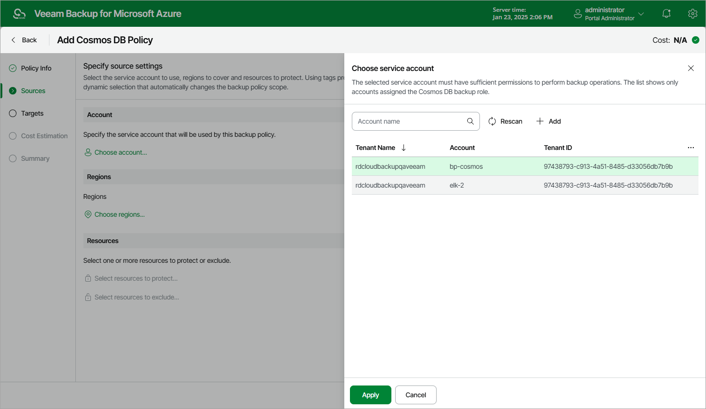
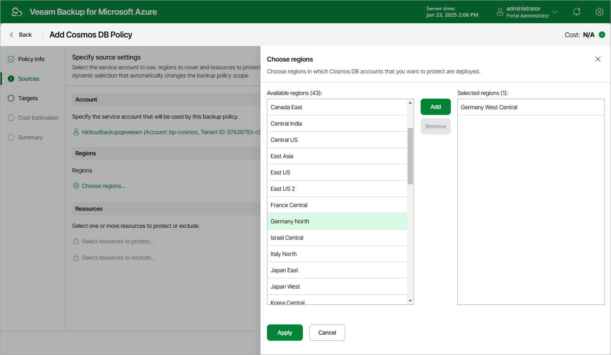
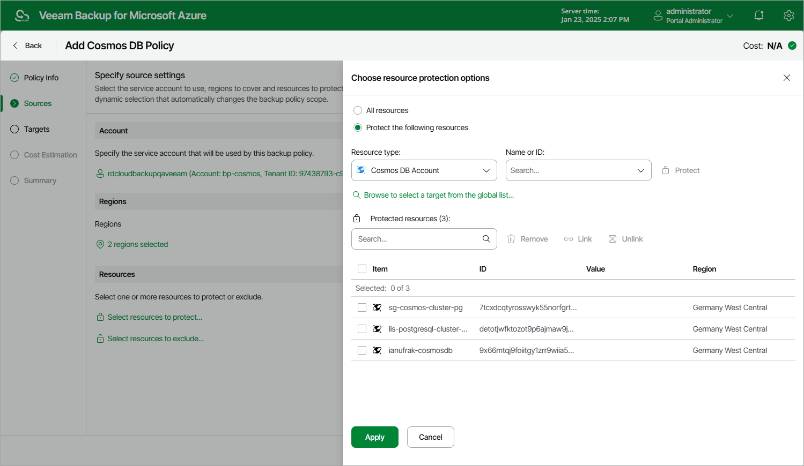

# Step 3. Configure Backup Source Settings

At the Sources step of the wizard, select a service account whose permissions will be used to perform Cosmos DB backup, choose regions where Cosmos DB accounts that you plan to back up reside, and select resources to back up.

Step 3a. Select Service Account

In the Account section of the Sources step of the wizard, specify a service account whose permissions will be used to access Azure services and resources, and to create backups of Cosmos DB accounts.

1. Click Choose account.
2. In the Choose service account window, select the necessary service account from the available accounts list. The specified service account must belong to the Microsoft Entra tenant that contains the Cosmos DB accounts that you want to protect, and must be assigned permissions listed in section [Cosmos DB Permissions](azure_cosmos_db_permissions.md#backup).

For a service account to be displayed in the list of available accounts, it must be added to Veeam Backup for Microsoft Azure and assigned the Cosmos DB Backup operational role as described in section [Adding Service Accounts](azure_service_account_add.md). If you have not added the necessary service account to Veeam Backup for Microsoft Azure beforehand, you can do it without closing the Add Cosmos DB Policy wizard. To do that, click Add and complete the Add Account wizard.

1. Click Apply.

Step 3b. Select Regions

In the Region section of the Sources step of the wizard, select regions where Azure resources that you want to back up reside.

1. Click Choose regions.
2. In the Choose regions window, select the necessary regions from the Available regions list, and then click Add.
3. Click Apply.

Step 3c. Select Resources

In the Resources section of the Sources step of the wizard, specify the backup scope — select resources that the backup appliance will back up:

1. Click Select resources to protect.
2. In the Choose resource protection options window, choose whether you want to back up all Azure resources from the regions selected at [step 3b](#regions), or only specific resources.

If you select the All resources option, the backup appliance will regularly check for new Cosmos DB accounts created in the selected regions and automatically update the backup policy settings to include these databases in the backup scope.

If you select the Protect the following resources option, you must also specify the resources explicitly:

1. Use the Resource type drop-down list to select either of the following options:

* Subscription — to back up Cosmos DB accounts managed by specific subscriptions.

* Resource group — to back up Cosmos DB accounts that reside in a specific Azure resource group.

* Tag — to back up Cosmos DB accounts with specific tags.
* Cosmos DB Account — to back up only specific Cosmos DB accounts.

1. Use the search field to the right of the Resource type list to find the necessary resource, and then click Protect to add the resource to the backup scope.

For a resource to be displayed in the list of available resources, it must reside in an Azure region that has ever been specified in any backup policy. Otherwise, the only option to discover available resources is to click Browse to select specific source from the global list and wait for the backup appliance to populate the resource list.

Note that your web browser zoom must not exceed 135% for the list of protected resources to be displayed correctly.

|  |
| --- |
| Tip |
| You can simultaneously add multiple resources to the backup scope. To do that, click Browse to select specific source from the global list, select check boxes next to the necessary items in the list of available resources, and then click Protect.  If the list does not show the resources that you want to back up, click Rescan to launch the data collection process — as soon as the process is over, the backup appliance will update the resource list. If you still cannot find the necessary resources in the list, make sure that the Microsoft.ManagedServices provider is registered in the subscription to which the resources belong, return to the [step 3a](#account) and click Rescan in the Choose service account window. To learn how to register a resource provider, see [Microsoft Docs](https://docs.microsoft.com/en-us/azure/azure-resource-manager/management/resource-providers-and-types#register-resource-provider). |

1. To save changes made to the backup policy settings, click Apply.

|  |
| --- |
| Tip |
| As an alternative to selecting the Protect the following resources option and specifying the resources explicitly, you can select the All resources option and exclude a number of resources from the backup scope. To do that, click Select resources to exclude and specify Cosmos DB accounts or tags that you want to exclude from the backup scope — the procedure is the same as described for including resources in the backup scope.  Consider that if a resource appears both in the list of included and excluded resources, the backup appliance will still not process the resource because the list of excluded resources has a higher priority. |

When you add subscriptions, resource groups and tags to the backup scope, Veeam Backup for Microsoft Azure links all these resources using the OR operator. To instruct Veeam Backup for Microsoft Azure to use the AND operator, follow the instructions provided in section [Configuring Conditions](azure_vm_sla_configuring_conditions.md).

|  |
| --- |
| Note |
| Cosmos DB accounts that have the Deleted status cannot be added to the backup scope. |

Page updated 2026-07-01

