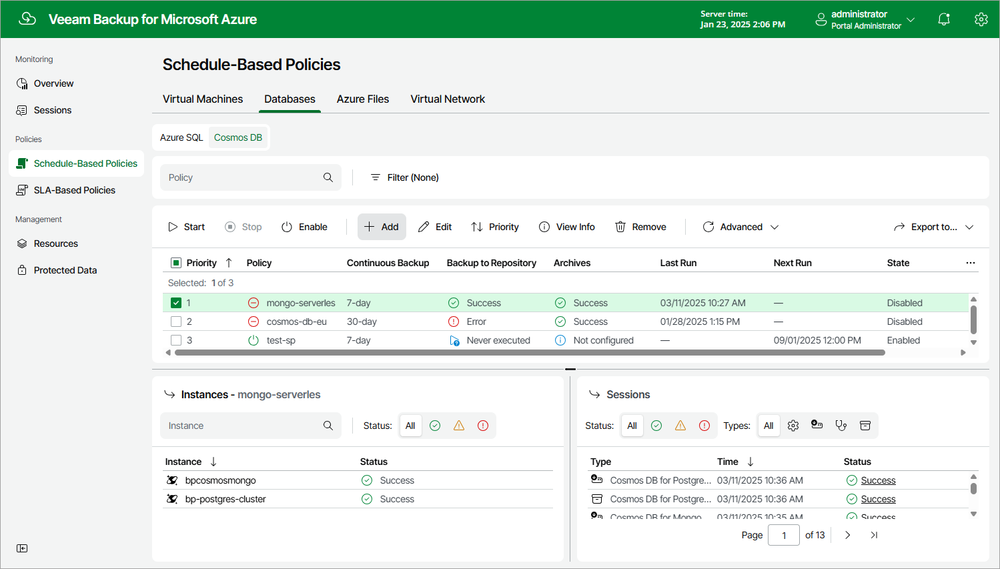

# Step 1. Launch Add Cosmos DB Policy Wizard

To launch the Add Cosmos DB Policy wizard, do the following:

1. Navigate to Schedule-Based Policies.
2. Switch to Databases > Cosmos DB.
3. Click Add.

Page updated 2025-03-18

