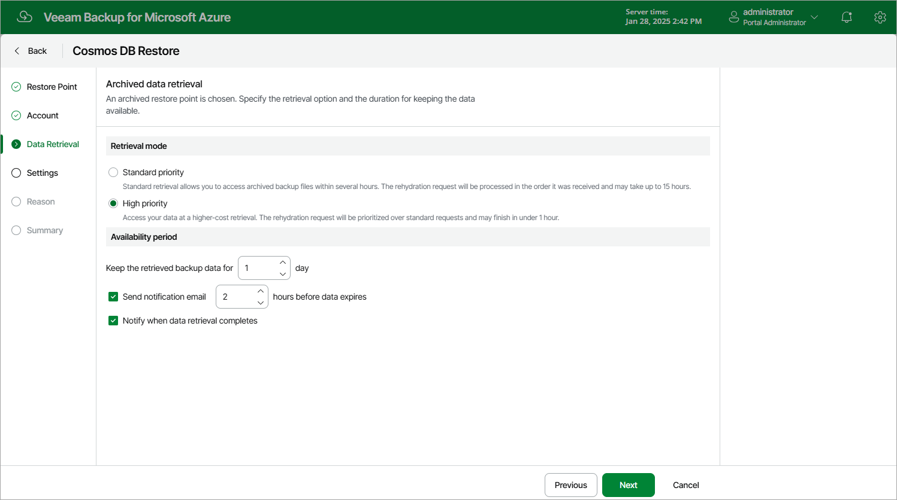

# Step 4. Specify Retrieval Settings

[This step applies only if you have selected a restore point stored in an archive repository at the Restore Point step of the wizard]

At the Data retrieval step of the wizard, choose a retrieval mode and specify a period for which you want to keep the data available.

1. In the Retrieval mode section, select the retrieval mode that the backup appliance will use to retrieve the archived data, and click Save. For more information on data retrieval modes, see [Retrieving Data From Archive](azure_retrieving_cosmos_db_data.md).

1. In the Availability period section, specify the number of days for which you want to keep the data available for restore operations. You can [manually extend the availability period](azure_retrieving_cosmos_db_data.md#extend) later if required.

|  |
| --- |
| Tip |
| If you want to receive an email notification when data availability period is about to expire, select the Send notification email check box and choose when you want to be notified (that is, the number of hours remaining until data expiration). |

Page updated 2026-07-01

