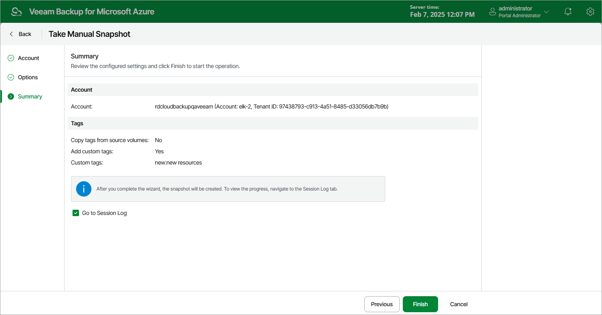

# Creating VM Snapshots Manually

Veeam Plug-in for Microsoft Azure allows you to manually create snapshots of Azure VMs. Each snapshot is saved to the same Azure region in which the protected Azure VM resides.

|  |
| --- |
| Note |
| The backup appliance does not include snapshots created manually in the snapshot chain and does not apply the [configured retention policy settings](azure_vm_backup_policy_schedule.md) to these snapshots. This means that the snapshots are kept in your Microsoft Azure environment unless you remove them manually, as described in section [Managing VM Data](azure_removing_vm_backups_and_snapshots.md). |

To manually create a cloud-native snapshot of an Azure VM, do the following:

1. Navigate to Resources > Virtual Machines.
2. Select the check box next to the necessary Azure VM and click Take Snapshot Now.

For an Azure VM to be displayed in the list of available resources, it must reside in any of the regions included in a backup policy as described in section [Creating VM Schedule-Based Backup Policies](azure_vm_backup_source_settings.md#resources) (step 3c) or in section [Creating VM SLA-Based Backup Policies](azure_vm_sla_source_settings.md#resources) (step 3c).

1. Complete the Take Manual Snapshot wizard:

1. At the Service account step of the wizard, select a service account whose permissions the backup appliance will use to create a snapshot.

For an account to be displayed in the accounts list, it must be added to the backup appliance as described in section [Adding Service Accounts](azure_service_account_add.md).

1. At the Options step of the wizard, click Tags from source volumes will not be copied and custom tags will not be applied to assign tags to cloud-native snapshots.
2. In the Tags configurations window, choose whether you want to assign tags to the created snapshot.

* To assign already existing tags from the source virtual disks, select the Copy Tags from source volume check box.
* To assign your own custom tags, set the Add custom tags to created snapshots toggle to On, and specify the tags explicitly. To do that, specify a key and a value for the new custom tag in the Key and Value fields, and then click Apply.

1. At the Summary step of the wizard, review configuration information, choose whether you want to proceed to the [Session Log page](azure_session_statistics.md) to track the progress of snapshot creation, and click Finish.

Page updated 2026-07-01

