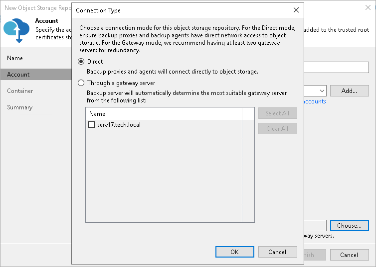
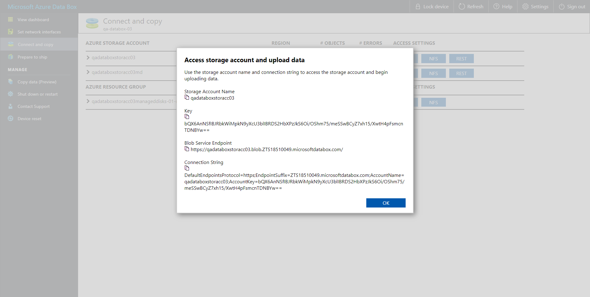

# Step 3. Specify Object Storage Account

At the Account step of the wizard, specify the connection settings:

1. In the Service endpoint field, specify a service endpoint address of your Azure Data Box device.
2. From the Credentials drop-down list, select user credentials to access your Azure Data Box storage.

If you already have a credentials record that was configured in advance, select such a record from the drop-down list. Otherwise, click Add and provide your access and secret keys, as described in section [Cloud Credentials Manager](cloud_credentials.md). You can also click the Manage cloud accounts link to add, edit or remove a credentials record.

For more information on where to find connection parameters of your Azure Data Box device, see [Getting Data Box Connection Parameters](#gdbe).

1. Next to the Connection mode field, click Choose and specify how Veeam Backup & Replication will transfer data to the object storage repository:

* Direct — select this option if you want to instantly move data of processed VMs or file shares to object storage repositories. Before you select this option, check the following [Considerations and Limitations](object_storage_repository_cal.md#directmode).

* Through gateway server — select this option if you want Veeam Backup & Replication to use gateway servers to transfer data from processed machines or file shares to object storage repositories. From the Name list, select gateway servers that you want to use for data transfer operations.

By default, the role of a gateway server is assigned to the Veeam Backup & Replication server. You can choose any Microsoft Windows or Linux server that is added to your backup infrastructure and has internet connection. Note that you must add the server to the backup infrastructure beforehand. Before you add the server, check the following [Considerations and Limitations](object_storage_repository_cal.md). For more information on how to add a server, see [Virtualization Servers and Hosts](setup_add_server.md).

Getting Data Box Connection Parameters

To find connection parameters of your Azure Data Box device, do the following:

1. Open the Microsoft Azure Data Box portal.
2. In the navigation pane, click Connect and Copy.
3. Under the Access Settings column of the storage account that you want to use, click REST and in the Access storage account and upload data dialog box, copy the following:

1. Under Storage Account Name, copy the Azure storage account name.
2. Under Key, copy the storage account key.
3. Under Blob Service Endpoint, copy the service endpoint address that starts exactly after the blob word.

For example, if the complete service endpoint address is https://qadataboxstoracc03.blob.ZTS18510049.microsoftdatabox.com, then you will need to copy everything that starts from ZTS only. That is, ZTS18510049.microsoftdatabox.com. Make sure not to copy the last slash ("/") symbol.

