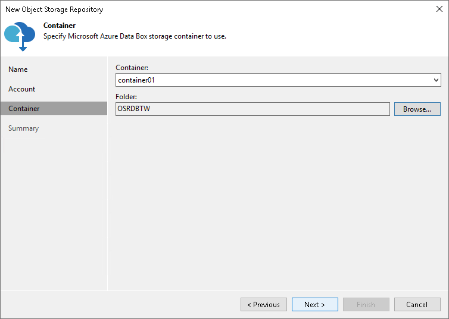

# Step 4. Specify Object Storage Settings

At the Container step of the wizard, specify the container and folder that will be used to store data:

1. From the Container drop-down list, select a container.

To create a container, use Microsoft Azure Storage Explorer. For more information on how to connect to the Azure Data Box device using Microsoft Azure Storage Explorer, see [Microsoft Docs](https://docs.microsoft.com/en-us/azure/databox/data-box-deploy-copy-data-via-rest#configure-partner-software-and-verify-connection).

1. In the Select Folder field, select a cloud folder to which you want to map your object storage repository.

To select a folder, click Browse and either select an existing folder or create a new one by clicking New Folder.

