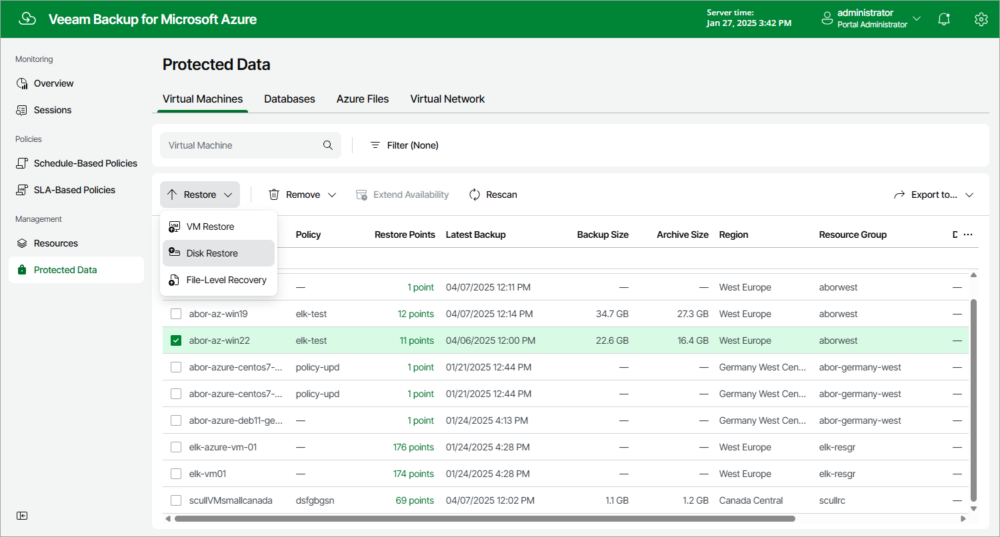

# Step 1. Launch Restore Disks Wizard

To launch the Restore Disks wizard, do the following:

1. Navigate to Protected Data > Virtual Machines.
2. Select the Azure VM whose virtual disks you want to restore.
3. Click Restore > Disk Restore.

You can also click the link in the Restore Points column. Then, in the Restore Points window, select the necessary restore point and click Restore > Disk Restore.

Page updated 2025-03-17

