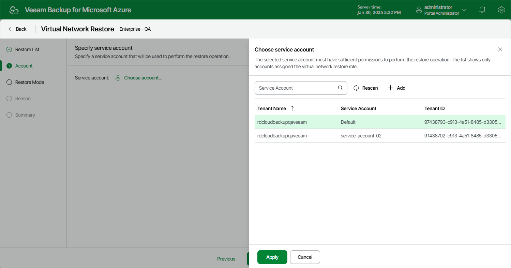

# Step 3. Specify Service Account

At the Account step of the wizard, choose a service account whose permissions will be used to perform the restore operation. To do that, click the link to the right of Service account and choose the necessary account from the list. The specified service account must be assigned permissions listed in section [Virtual Network Configuration Permissions](azure_vnet_permissions.md#restore).

For a service account to be displayed in the list of available accounts, it must be added to the backup appliance and assigned the Virtual Network Restore operational role as described in section [Adding Service Accounts](azure_service_account_add.md).

|  |
| --- |
| Important |
| Consider the following:   * Make sure that the specified service account belongs to an Microsoft Entra tenant in which you plan to restore the virtual network configuration. * It is recommended that you check whether the selected service account has all the permissions required to perform the operation. If the service account permissions are insufficient, the restore operation will fail to complete successfully. To run the service account permission check, follow the instructions provided in section [Checking Service Account Permissions](azure_service_account_check.md). |

Page updated 2026-07-01

