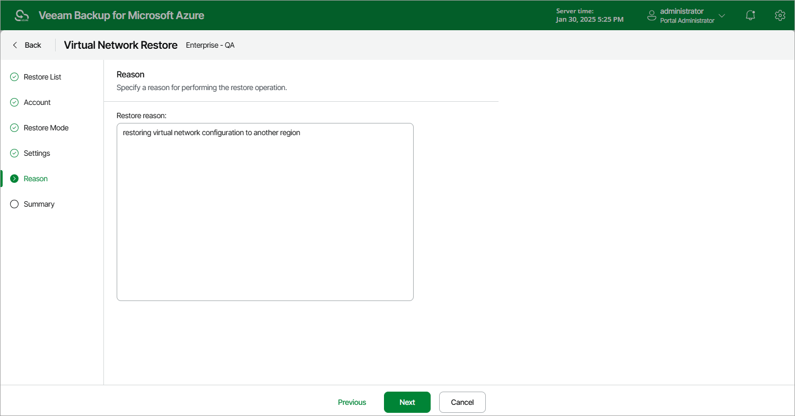

# Step 6. Specify Restore Reason

At the Reason step of the wizard, specify a reason for restoring virtual network configuration. The information you provide will be saved in the session history and you can reference it later.

Page updated 2024-06-12

