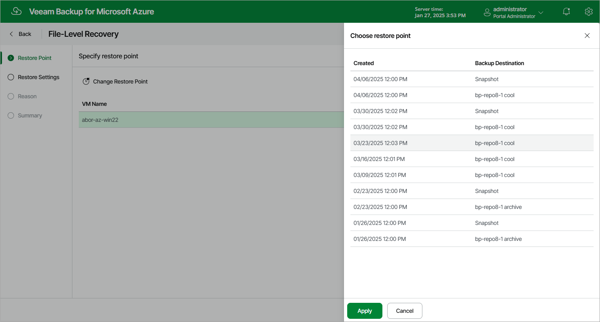

# Step 2. Select Restore Point

At the Restore Point step of the wizard, select a restore point that will be used to recover files and folders of the selected Azure VM. By default, Veeam Backup & Replication uses the most recent valid restore point. However, you can restore the Azure VM data to an earlier state.

To select a restore point, do the following:

1. Select the Azure VM.
2. Click Change Restore Point.
3. In the Choose restore point window, select the necessary restore point and click Apply.

To help you choose a restore point, Veeam Backup & Replication provides the following information on each available restore point:

* Created — the date when the restore point was created.
* Backup Destination — the type of the restore point:

* <Repository name> — an image-level backup created by a backup policy.
* Snapshot — a cloud-native snapshot created by a backup policy.
* Manual snapshot — a cloud-native snapshot created manually.

|  |
| --- |
| Important |
| If you select a restore point stored in an archive repository, you will be redirected to the [Data Retrieval wizard](azure_retrieving_vm_data.md). Complete the Data Retrieval wizard, wait until the retrieval operation completes and then launch the File-Level Recovery wizard again. |

Page updated 2026-07-01

