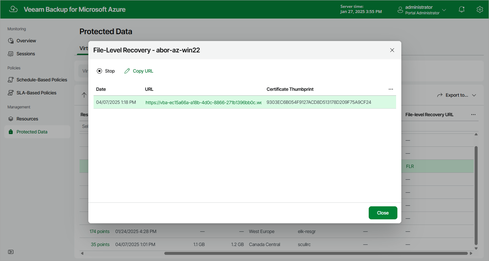

# Step 5. Start Recovery Session

At the Summary step of the wizard, review summary information and click Start.

As soon as you click Start, the backup appliance will close the Azure Files File-Level Recovery wizard and start a restore session. You can track the progress of the restore session in the File-Level Recovery window. To open the File-Level Recovery window, navigate to Protected Data and click the link in the File-Level Recovery URL column. During the recovery session, the backup appliance will launch a worker instance and attach virtual disks of the processed Azure VM to it.

In the URL column of the window, the backup appliance will display a link to the file-level recovery browser. You can use the link in either of the following ways:

* Click the link to open the file-level recovery browser on your local machine while the recovery session is running.
* Copy the link, close the File-Level Recovery window and open the file-level recovery browser on another machine.

|  |
| --- |
| Important |
| When you click Copy URL, the backup appliance copies the following information to the clipboard:   * A link to the file-level recovery browser that includes a public DNS name of the worker instance hosting the browser and authentication information used to access the browser. However, if you instructed Veeam Backup for Microsoft Azure not to assign public IP addresses to worker instances used for file-level recovery operations as described in [Adding Worker Configurations](azure_worker_configuration_network.md), Veeam Backup for Microsoft Azure copies only the private IP address of the worker instance. * A thumbprint of a TLS certificate installed on the worker instance hosting the file-level recovery browser.   To avoid a man-in-the-middle attack, before you start recovering files and folders, check that the certificate thumbprint displayed in the web browser from which you access the file-level recovery browser matches the provided certificate thumbprint. |

Page updated 2026-07-01

