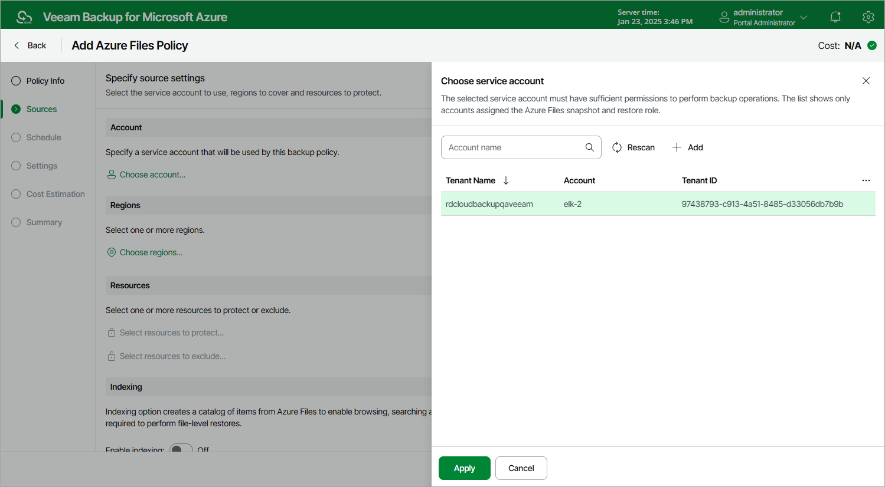
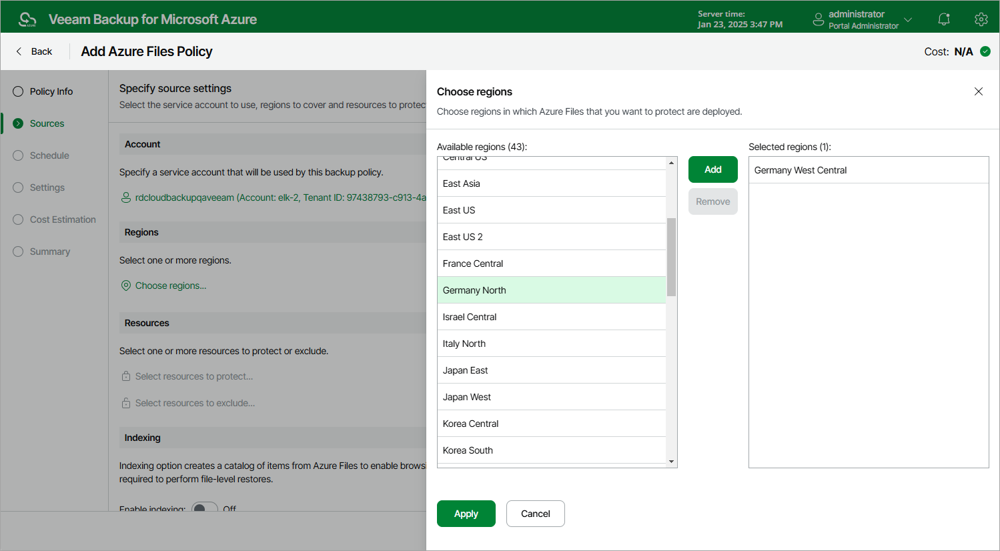
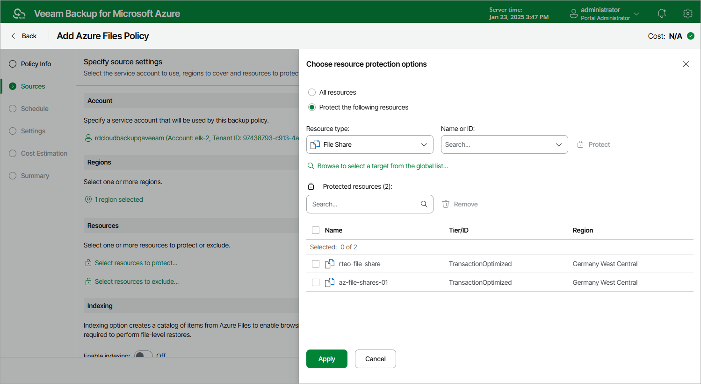
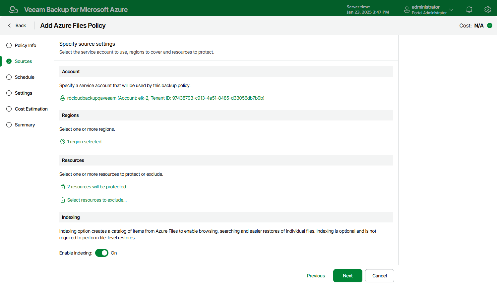

# Step 3. Configure Backup Source Settings

At the Sources step of the wizard, select a service account whose permissions will be used to perform Azure Files backup, choose regions where Azure file shares that you plan to back up reside, select resources to back up and enable Azure file share indexing.

Step 3a. Select Service Account

In the Account section of the Sources step of the wizard, specify a service account whose permissions will be used to access Azure services and resources, and to create cloud-native snapshots of Azure file shares.

1. Click Choose account.
2. In the Choose service account window, select the necessary service account from the available accounts list. The specified service account must belong to the Microsoft Entra tenant that contains the Azure file shares that you want to protect, and must be assigned permissions listed in section [Azure Files Permissions](azure_fs_permissions.md).

For a service account to be displayed in the list of available accounts, it must be added to the backup appliance and assigned the Azure Files Snapshot and Restore operational role as described in section [Adding Service Accounts](azure_service_account_add.md). If you have not added the necessary service account to the backup appliance beforehand, you can do it without closing the Add Azure Files Policy wizard. To do that, click Add and complete the Add Account wizard.

1. Click Apply.

Step 3b. Select Regions

In the Region section of the Sources step of the wizard, select regions where Azure resources that you want to protect reside.

1. Click Choose regions.
2. In the Choose regions window, select the necessary regions from the Available regions list, and then click Add.
3. Click Apply.

Step 3c. Select Resources

In the Resources section of the Sources step of the wizard, specify the backup scope — select resources that the backup appliance will back up.

1. Click Select resources to protect.
2. In the Choose resource protection options window, choose whether you want to protect all Azure resources from the regions selected at [step 3b](#regions), or only specific resources.

If you select the All resources option, the backup appliance will regularly check for new Azure file shares created in the selected regions and automatically update the backup policy settings to include these file shares in the backup scope.

If you select the Protect the following resources option, you must also specify the resources explicitly:

1. Use the Resource type drop-down list to select either of the following options:

* Resource group — to protect Azure file shares that belong to specific resource groups.

* File Share — to protect only specific Azure file shares.

* Storage account — to protect Azure file shares that reside in specific storage accounts.

1. Use the search field to the right of the Resource type list to find the necessary resource, and then click Protect to add the resource to the backup scope.

For a resource to be displayed in the list of available resources, it must reside in an Azure region that has ever been specified in any backup policy. Otherwise, the only option to discover available resources is to click Browse to select a target from the global list and wait for the backup appliance to populate the resource list.

Note that your web browser zoom must not exceed 135% for the list of protected resources to be displayed correctly.

|  |
| --- |
| Tip |
| You can simultaneously add multiple resources to the backup scope. To do that, click Browse to select a target from the global list, select check boxes next to the necessary items in the list of available resources, and then click Protect.  If the list does not show the resources that you want to protect, click Rescan to launch the data collection process — as soon as the process is over, the backup appliance will update the resource list. If you still cannot find the necessary resources in the list, make sure that the Microsoft.ManagedServices provider is registered in the subscription to which the resources belong, return to [step 3a](#account) and click Rescan in the Choose service account window. To learn how to register a resource provider, see [Microsoft Docs](https://docs.microsoft.com/en-us/azure/azure-resource-manager/management/resource-providers-and-types#register-resource-provider). |

1. To save changes made to the backup policy settings, click Apply.

|  |
| --- |
| Tip |
| As an alternative to selecting the Protect the following resources option and specifying the resources explicitly, you can select the All resources option and exclude a number of resources from the backup scope. To do that, click Select resources to exclude and specify Azure file shares that you do not want to protect — the procedure is the same as described for including resources in the backup scope.  Consider that if a resource appears both in the list of included and excluded resources, the backup appliance will still not process the resource because the list of excluded resources has a higher priority. |

Step 3d. Enable File Share Indexing

While performing Azure file share indexing for a file system, Veeam Backup for Microsoft Azure creates a catalog of all files and directories (that is, the index) and saves the index to the configuration database on the backup appliance. This index is further used to reproduce the file system structure and to enable browsing and searching for specific files across multiple restore points. To learn how indexing works, see [Azure Files Backup](azure_how_fs_backup_works.md).

|  |
| --- |
| Important |
| When performing indexing operations, Veeam Backup for Microsoft Azure uses the Server Message Block (SMB) 3.0 and New Technology LAN Manager (NTLM) v2 protocols to authenticate against the processed file shares. That is why authentication using these protocols must be enabled on the file shares that you plan to index. Otherwise, indexing of the file shares will fail.  For more information on Azure Files identity-based authentication options for SMB access, see [Microsoft Docs](https://docs.microsoft.com/en-us/azure/storage/files/storage-files-active-directory-overview). |

In the Indexing section of the Sources step of the wizard, you can instruct Veeam Backup for Microsoft Azure to perform indexing of the processed Azure file shares. To do that, set the Enable indexing toggle to On.

|  |
| --- |
| Note |
| Azure file share indexing is not supported in the Free edition of Veeam Backup for Microsoft Azure. For more information on license editions, see [Licensing](azure_licensing.md). |

Page updated 2026-07-01

