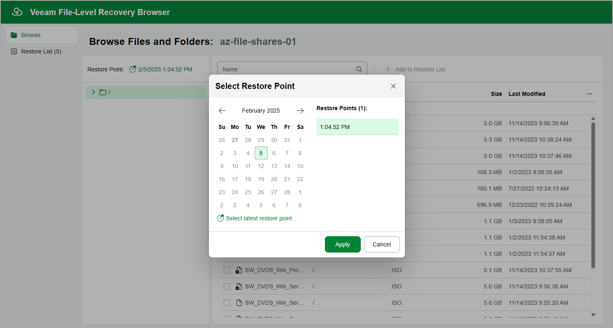

# Step 6. Select Restore Point

By default, Veeam Backup for Microsoft Azure uses the most recent valid restore point. However, you can restore files and folders to an earlier state.

To select a restore point in the file-level recovery browser, do the following:

1. On the Browse tab, click the link in the Restore Point field.
2. In the Select Restore Point window, choose a date when the restore point was created, select the necessary restore point from the Restore Points list and click Apply.

Page updated 2025-05-28

