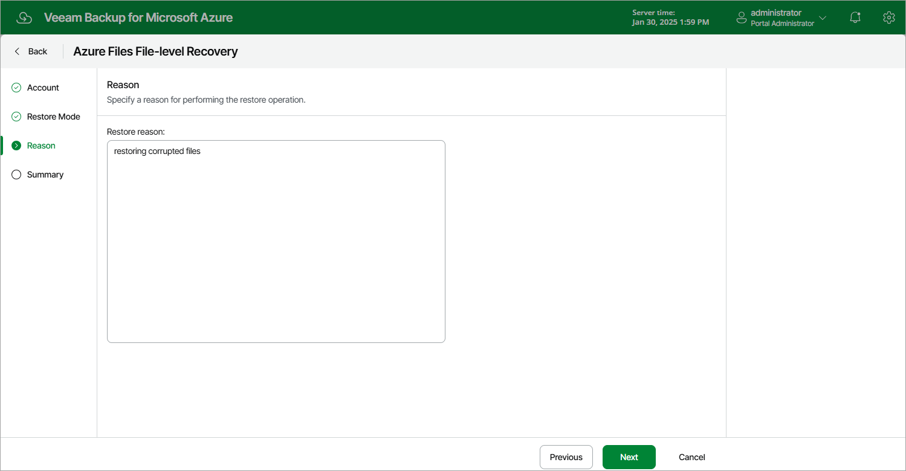

# Step 4. Specify Restore Reason

At the Reason step of the wizard, specify a reason for restoring files and folders. This information will be saved to the session history, and you will be able to reference it later.

Page updated 2023-12-01

