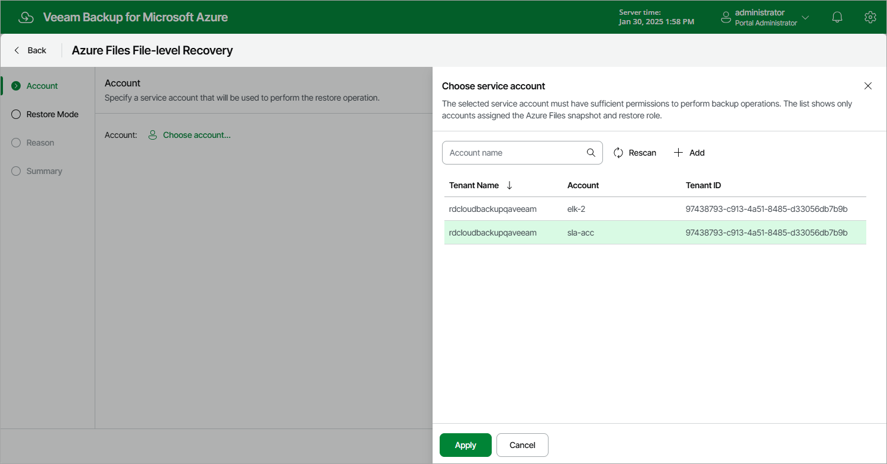

# Step 2. Select Service Account

At the Account step of the wizard, select a service account whose permissions the backup appliance will use to perform the restore operation.

1. Click Choose account.
2. In the Choose service account window, select the necessary account and click Apply. The specified service account must be assigned permissions listed in section [Azure Files Permissions](azure_fs_permissions.md).

For a service account to be displayed in the list of available accounts, it must be added to the backup appliance and assigned theAzure Files Snapshot and Restore operational role as described in section [Adding Service Accounts](azure_service_account_add.md). If you have not added the necessary service account to the backup appliance beforehand, you can do it without closing the Azure Files File-Level Recovery wizard. To do that, click Add and complete the Add Account wizard.

Page updated 2026-07-01

