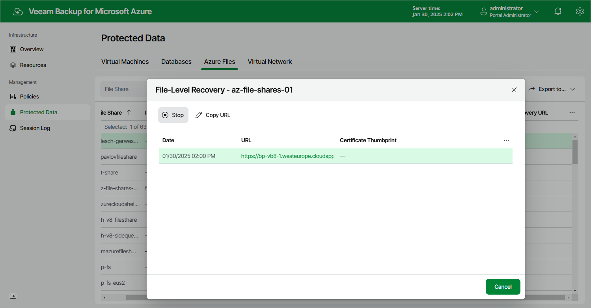

# Step 8. Stop Restore Session

After you finish working with the file-level recovery browser, it is recommended that you stop the restore session. To do that, click Stop in the File-Level Recovery window. If you do not perform any actions in the file-level recovery browser for 30 minutes, and if no files are being restored, the backup appliance will stop the restore session automatically.

|  |
| --- |
| Tip |
| If you accidentally close the File-Level Recovery window, navigate to Protected Data and click the link in the File-Level Recovery URL column to open the window again. |

Page updated 2026-07-01

