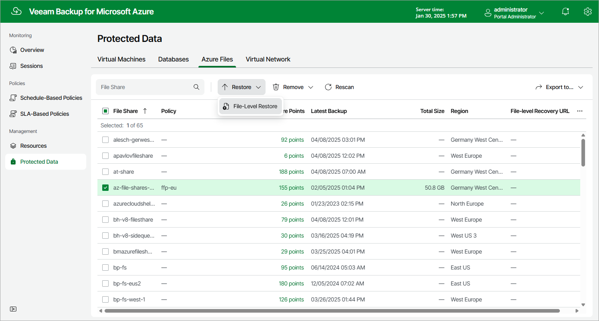

# Step 1. Launch Azure Files File-Level Recovery Wizard

To launch the Azure Files File-Level Recovery wizard, do the following:

1. Navigate to Protected Data > Azure Files.
2. Select the Azure file share that you want to restore.
3. Click Restore > File-Level Restore.

Page updated 2025-05-28

