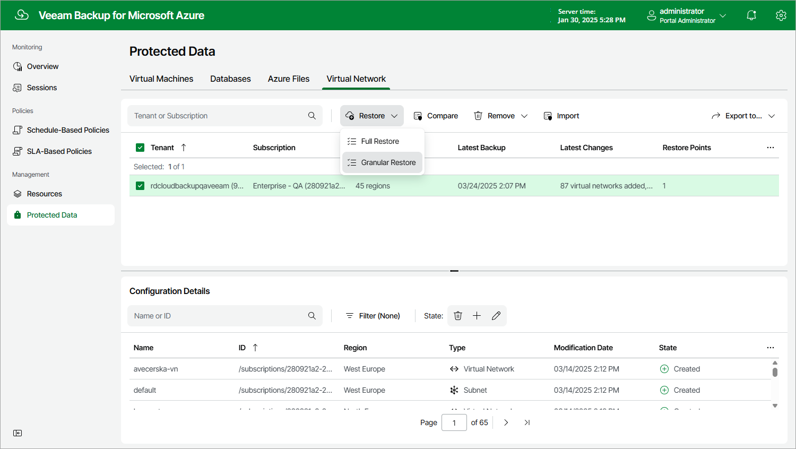

# Step 1. Launch Virtual Network Restore Wizard

To launch the Virtual Network Restore wizard, do the following:

1. Navigate to Protected Data > Virtual Network.
2. Select the configuration record for an Azure subscription whose virtual network configuration you want to restore.
3. Click Restore > Granular Restore.

Page updated 2024-06-12

