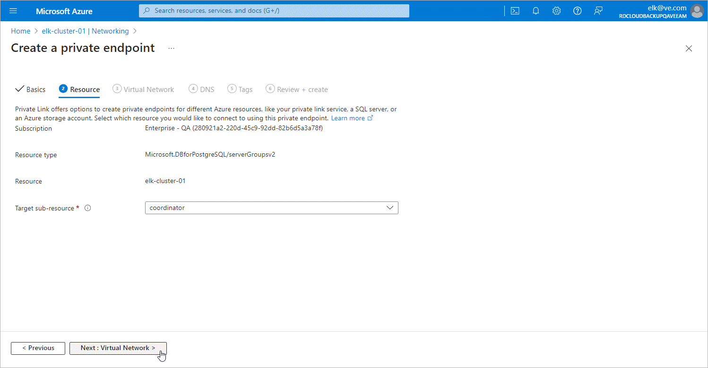

# Step 2c. Specify Resource Settings

At the Resource step of the Create a private endpoint wizard, select coordinator from the Target sub-resource drop-down list and click Next: Virtual Network >.

Page updated 2024-07-01

