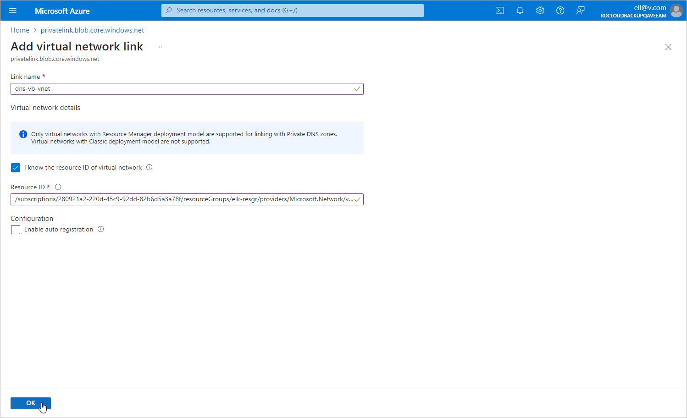

# Step 3. Add VNets to Private DNS Zones

To allow Veeam Backup for Microsoft Azure to perform backup operations in the private environment, you must add the VNet to which the backup appliance is connected and the VNet selected for the worker configuration created at [step 2](azure_pne_sql_worker_configuration.md) to the DNS zones privatelink.blob.core.windows.net and privatelink.queue.core.windows.net created at [step 1](azure_pne_sql_dns_zones.md).

To add a VNet to a DNS zone, do the following:

1. Log in to the [Microsoft Azure portal](https://portal.azure.com).
2. Open the Resource group page.
3. In the Resource list, locate and click the necessary VNet. The Virtual network page will open.
4. Navigate to JSON view. In the Resource JSON window, navigate to the Resource ID field and copy the ID to the clipboard.
5. Back to the Resource group page, in the Resource list, locate and click the necessary private DNS zone.
6. On the Private DNS zone page, navigate to Settings > Virtual network links and click Add.
7. In the Add virtual network link window, create a link to the VNet:

1. In the Link name field, specify a name for the link.
2. In the Virtual network details section, select the I know the resource ID of virtual network check box.
3. In the Resource ID field, paste the ID of the VNet and click OK.

Page updated 2025-05-07

