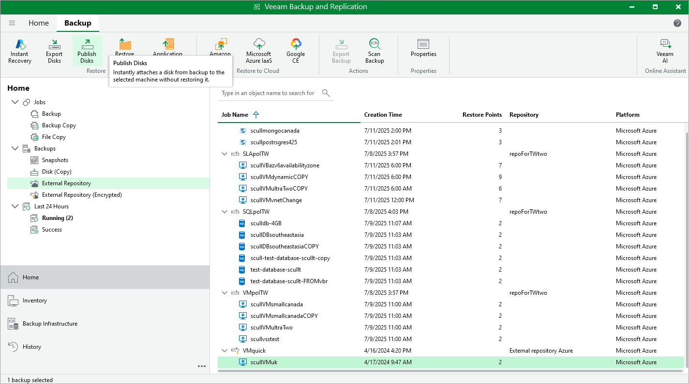

# Publishing Disks

Veeam Backup & Replication allows you to publish point-in-time disks, that is, to attach specific virtual disks of backed-up Azure VMs to any server to instantly access data in the read-only mode. You can copy the necessary files and folders to the target server, and perform an antivirus scan of the backed-up data. For more information, see [Disk Publishing (Data Integration API)](data_integration_api.md).

|  |
| --- |
| Important |
| Disk publishing cannot be performed using backups that are stored in [Veeam Data Cloud storage vaults](azure_vdc_vaults.md). To perform this operation, use backups that are stored in standard backup repositories for which you have specified Microsoft Azure storage account credentials. To learn how to specify credentials for repositories, see sections [Creating New Repositories](azure_repository_console_storage_account.md) and [Connecting to Existing Appliances](azure_adding_appliance_repository.md). |

To publish virtual disks of an Azure VM, do the following:

1. In the Veeam Backup & Replication console, open the Home view.
2. Navigate to Backups > External Repository.
3. Expand the necessary backup policy, select the Azure VM whose disks you want to publish and click Publish Disks on the ribbon.
4. Complete the Publish Disks wizard as described in [Publishing Disks](publishing_disks.md).

Page updated 2026-06-26

