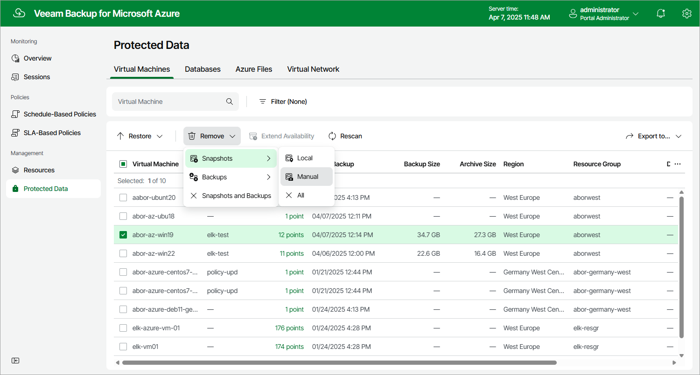

# Removing VM Snapshots Created Manually

To remove all cloud-native snapshots created for an Azure VM manually, follow the instructions provided in [Removing VM Backups and Snapshots](azure_removing_vm_backups_and_snapshots.md). If you want to remove a specific cloud-native snapshot created manually, do the following:

1. Navigate to Protected Data.
2. Select the check box next to the necessary Azure VM, and click the link in the Restore Points column.
3. In the Available Restore Points window, select the necessary snapshot and click Remove Manual Snapshot.

Related Topics

[Creating VM Snapshots Manually](azure_creating_vm_snapshots_manually.md)

Page updated 2025-03-13

