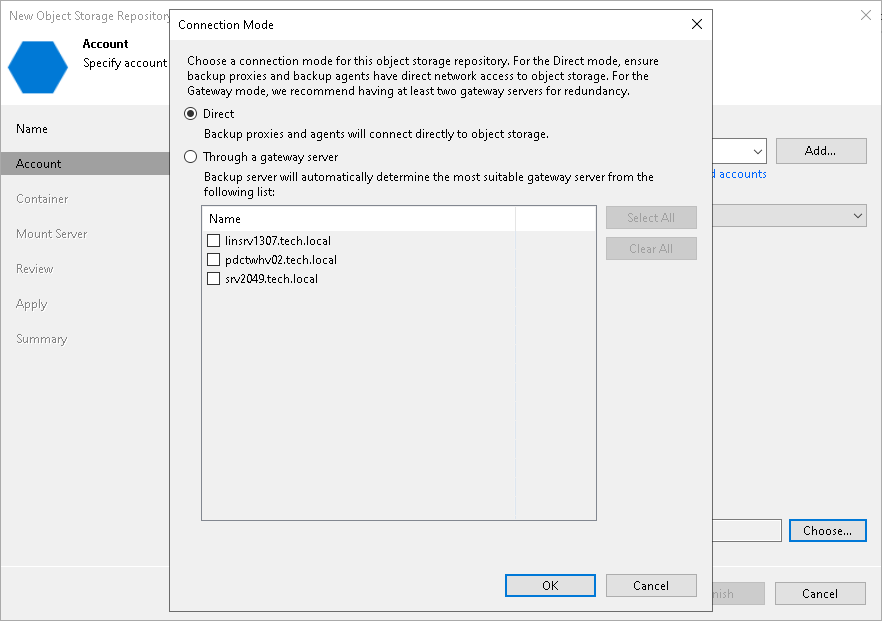

# Step 3. Specify Object Storage Account

At the Account step of the wizard, specify the connection settings:

1. From the Credentials drop-down list, select user credentials to access your Azure Blob storage.

If you already have a credentials record that was configured in advance, select such a record from the drop-down list. Otherwise, add the credentials record using either [your account name and a shared key](cloud_credentials_azure_storage.md) or specify [Microsoft Azure Entra ID storage account](azure_entra_id.md). You can also click the Manage cloud accounts link to add, edit or remove a credentials record.

|  |
| --- |
| Important |
| Keep in mind that in case you add a new Microsoft Azure Entra ID storage account, it takes from 30 to 60 seconds to propagate it on the Microsoft Azure side. |

1. From the Region drop-down list, select an Azure region.

1. Next to the Connection mode field, click Choose and specify how Veeam Backup & Replication will transfer data to the object storage repository:

* Direct — select this option if you want to instantly move data of processed VMs or file shares to object storage repositories. Before you select this option, check the following [Considerations and Limitations](object_storage_repository_cal.md#directmode).

* Through gateway server — select this option if you want Veeam Backup & Replication to use gateway servers to transfer data from processed machines or file shares to object storage repositories. From the Name list, select gateway servers that you want to use for data transfer operations.

By default, the role of a gateway server is assigned to the Veeam Backup & Replication server. You can choose any Microsoft Windows or Linux server that is added to your backup infrastructure and has internet connection. Note that you must add the server to the backup infrastructure beforehand. Before you add the server, check the following [Considerations and Limitations](object_storage_repository_cal.md). For more information on how to add a server, see [Virtualization Servers and Hosts](setup_add_server.md).

