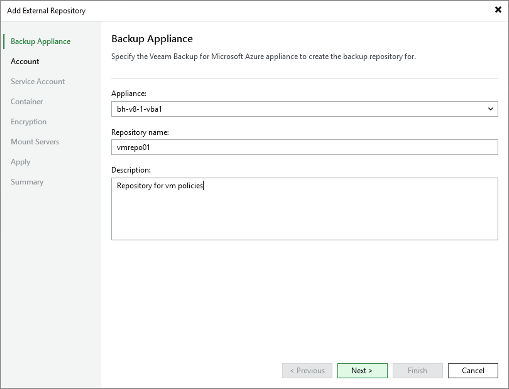

# Step 2. Specify Repository Details

At the Backup Appliance step of the wizard, do the following:

1. From the Appliance drop-down list, select a backup appliance that will manage the repository.

For an appliance to be displayed in the Appliance drop-down list, it must be added to the backup infrastructure as described in section [Adding Appliances](azure_adding_appliance_console.md).

1. In the Repository name and Description fields, enter a name for the new repository and provide a description for future reference. The maximum length of the name is 127 characters; the following characters are not supported: \ / " ' [ ] : | < > + = ; , ? \* @ & \_ .

Veeam Backup & Replication will create a folder with the specified name in the blob container that you will specify at [step 5](azure_repository_console_container.md). This folder will be used to store backed-up data.

Page updated 2026-04-29

