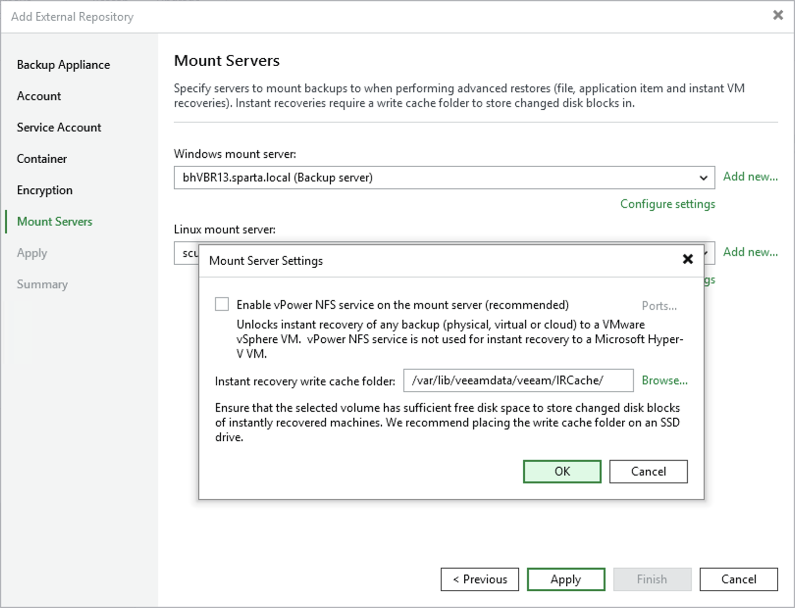

# Step 7. Specify Mount Server Settings

To perform guest OS file restore and application restore operations, Veeam Backup & Replication uses [mount servers](azure_mount_servers.md). By default, these servers are selected automatically depending on the operating system of the processed VM.

If Veeam Backup & Replication fails to choose a mount servers automatically or you want to specify a server manually, do the following:

1. To perform restore operations on Windows-based VMs, select the necessary server from the Windows mount server list. For a server to be displayed in the list of available servers, it must be added to the backup infrastructure as described in [Adding Microsoft Windows Servers](add_windows_server_console.md). If you have not added the server to Veeam Backup & Replication beforehand, you can do it without closing the Add External Repository wizard. To do that, click Add and complete the New Windows Server wizard.
2. To perform restore operations on Linux-based VMs, select the necessary server from the Linux mount server list. For a server to be displayed in the list of available servers, it must be added to the backup infrastructure as described in [Adding Linux Servers](add_linux_server_console.md). If you have not added the necessary server to Veeam Backup & Replication beforehand, you can do it without closing the Add External Repository wizard. To do that, click Add and complete the New Linux Server wizard.
3. To perform Instant Recovery or scan backups with SureBackup in VMware vSphere environments, click Configure settings. In the Mount Server Settings window, do the following:

1. Select the Enable vPower NFS service on the mount server check box to make the backup repository accessible by the [Veeam vPower NFS Service](vpower_nfs_service.md).

|  |
| --- |
| Important |
| It is not recommended that you enable Microsoft Windows NFS services on the same VM that runs Veeam vPower NFS Service. Otherwise, both services may fail to work properly. |

1. Click Ports to customize network ports used by the Veeam vPower NFS Service. By default, Veeam vPower NFS Service uses port 1058 to mount the vPower NFS datastore to the ESXi host and port 2049 to connect to the target NFS share.
2. In the Instant recovery write cache folder field, specify a folder that will be used for storing cache files.

Related Topics

* [Verifying Backups](azure_verify_backups.md)
* [Instant Recovery](azure_performing_instant_recovery.md)
* [Performing Guest OS File Recovery](azure_guest_file_recovery.md)
* [Performing Application Item Restore](azure_application_items_restore.md)

Page updated 2026-06-26

