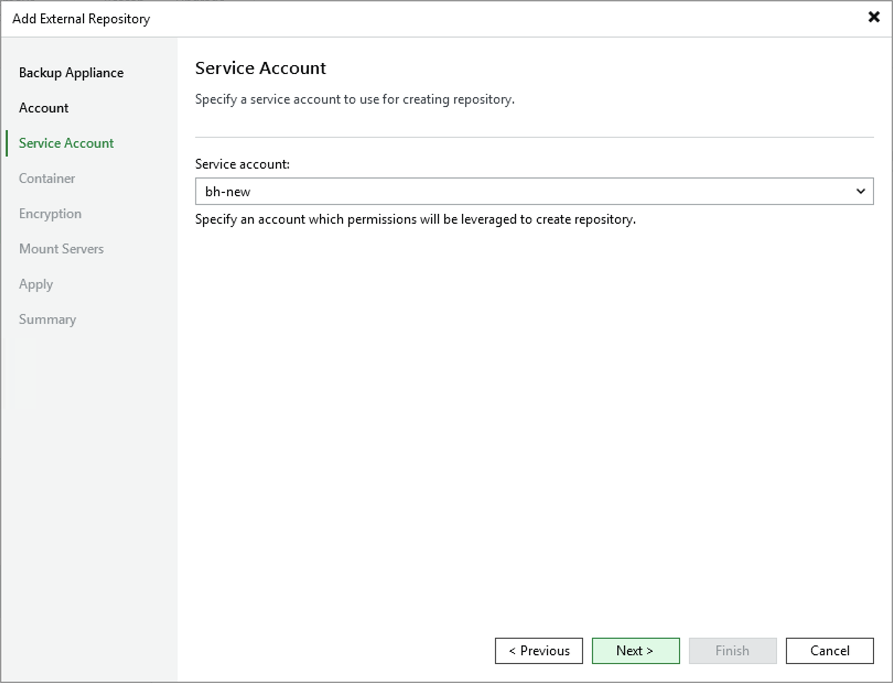

# Step 4. Specify Service Account

At the Service Account step of the wizard, specify a service account whose permissions Veeam Backup for Microsoft Azure will use to access the Microsoft Azure storage account specified at [step 3](azure_repository_console_storage_account.md).

For a service account to be displayed in the Service account list, it must be added to the backup appliance as described in section [Adding Service Accounts](azure_service_account_add.md).

Page updated 2026-02-04

