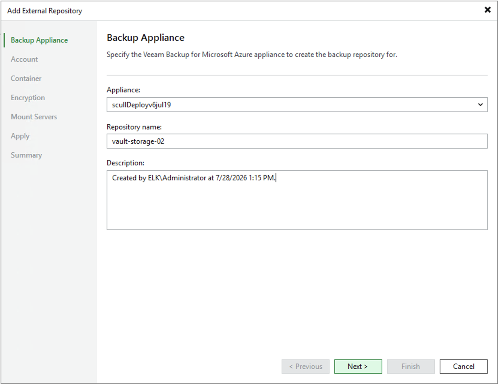

# Step 2. Specify Repository Details

At the Backup Appliance step of the wizard, select a backup appliance that will manage the storage vault. For an appliance to be displayed in the Appliance drop-down list, it must be added to the backup infrastructure as described in section [Deploying Backup Appliance](azure_deploying_appliance.md) or [Connecting to Existing Appliances](azure_connecting_appliance_console.md).

Then, enter a name for the new storage vault and provide a description for future reference. The maximum length of the name is 125 characters; the following characters are not supported: \ / " ' [ ] : | < > + = ; , ? \* @ & \_ .

|  |
| --- |
| Important |
| Since Veeam Plug-in for Microsoft Azure does not support adding storage vaults located in China or Azure US Government regions, Veeam Backup & Replication displays the list of appliances located in Azure global regions only. |

Page updated 2026-07-28

