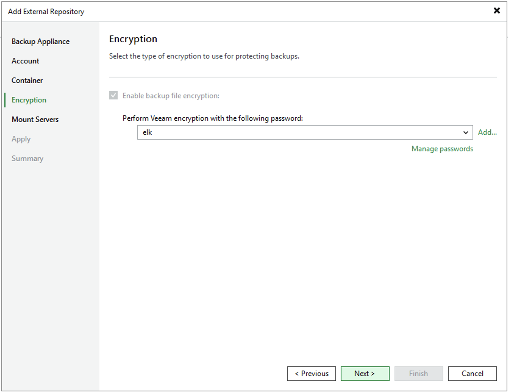

# Step 5. Enable Data Encryption

At the Encryption step of the wizard, select from the drop-down list the password you want to use to encrypt backups stored in the created storage vault.

|  |
| --- |
| Note |
| Veeam Backup & Replication does not support adding storage vaults with encryption disabled. That is why you will not be able to clear the Enable backup file encryption check box. For more information on data encryption, see [Overview](azure_data_encryption.md). |

For a password to be displayed in the list of available passwords, it must be added to Veeam Backup & Replication as described in section [Creating Passwords](password_manager_create.md). If you have not added the necessary password beforehand, you can do it without closing the wizard. To do that, click either the Manage passwords link or the Add button, and specify the password and hint in the Password window.

Page updated 2026-07-28

