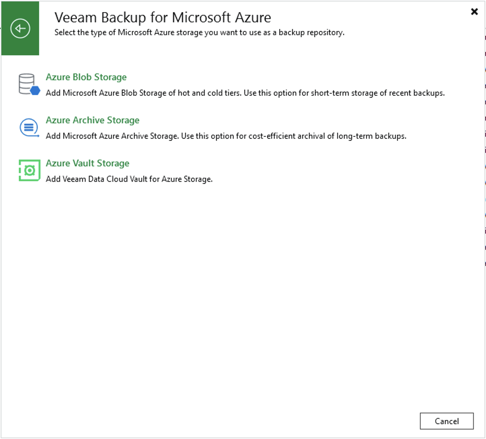

# Step 1. Launch Add External Repository Wizard

To launch the Add External Repository wizard, do the following:

1. In the Veeam Backup & Replication console, open the Backup Infrastructure view.
2. Navigate to External Repositories and click Add Repository on the ribbon.

Alternatively, you can right-click the External Repositories node and select Add.

1. In the Add External Repository window, click Veeam Backup for Microsoft Azure and select the Azure Vault Storage option.

Page updated 2026-07-28

