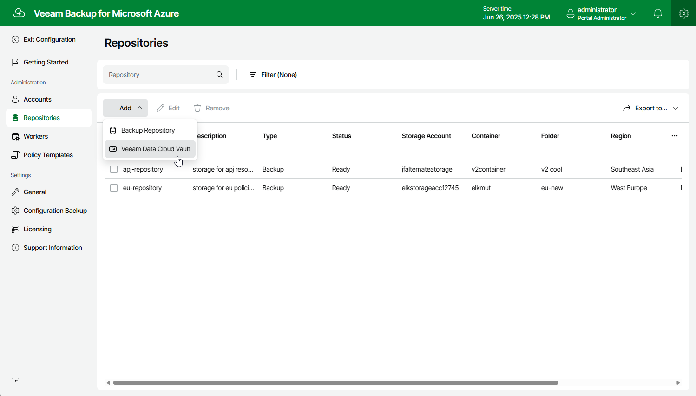

# Step 1. Launch Add Repository Wizard

To launch the Add Repository wizard, do the following:

1. Switch to the Configuration page.
2. Navigate to Repositories.
3. Click Add > Veeam Data Cloud Vault.

Page updated 2025-07-03

