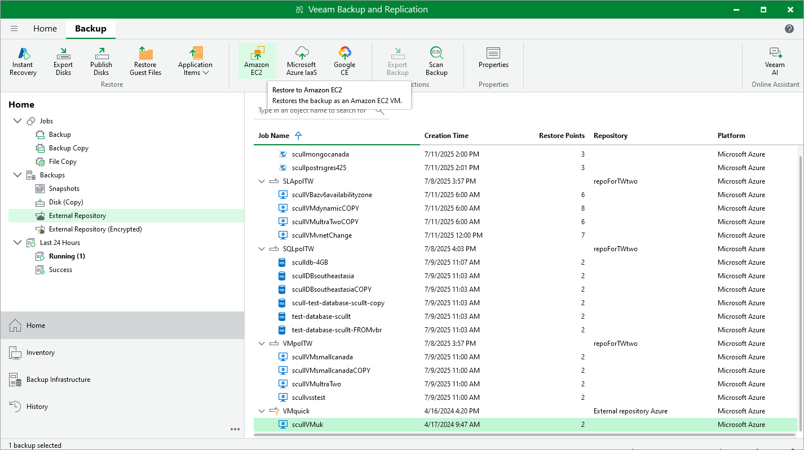

# Restoring to AWS

Veeam Backup & Replication allows you to restore Azure VMs from image-level backups created with Veeam Backup for Microsoft Azure to AWS as EC2 instances. You can restore Azure VMs to any available restore point. For more information, see [Restore to Amazon EC2](restore_amazon.md).

|  |
| --- |
| Important |
| Consider the following:   * Restore to AWS cannot be performed using backups that are stored in [Veeam Data Cloud storage vaults](azure_vdc_vaults.md). To perform this operation, use backups that are stored in standard backup repositories for which you have specified Microsoft Azure storage account credentials. To learn how to specify credentials for repositories, see sections [Creating New Repositories](azure_repository_console_storage_account.md) and [Connecting to Existing Appliances](azure_adding_appliance_repository.md). * Before you start the restore operation, check the limitations and prerequisites described in [Before You Begin](restore_amazon_byb.md). |

To restore an Azure VM to AWS, do the following:

1. In the Veeam Backup & Replication console, open the Home view.
2. Navigate to Backups > External Repository.
3. Expand the backup policy that protects an Azure VM that you want to restore, select the necessary VM and click Amazon EC2 on the ribbon.

1. Complete the Restore to Amazon EC2 wizard as described in [Restoring to Amazon EC2](restore_amazon_account.md).

Page updated 2026-06-26

