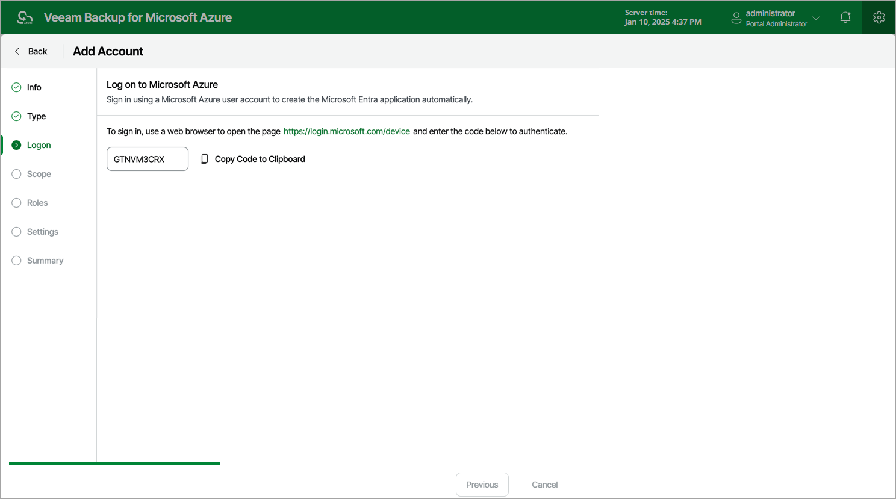

# Creating New Microsoft Entra Application

[This step applies only if you have selected the Create service account automatically option at the Type step of the wizard]

When you choose to create a service account automatically, Veeam Backup for Microsoft Azure creates a new [Microsoft Entra application](https://docs.microsoft.com/en-us/azure/active-directory/develop/active-directory-how-applications-are-added) in your Microsoft Entra ID. To create the Microsoft Entra application, Veeam Backup for Microsoft Azure uses the Microsoft Azure Cross-platform Command Line Interface (Azure CLI). To authenticate to the Azure CLI, you must provide a single-use verification code.

|  |
| --- |
| Important |
| Consider the following:   * If you have disabled the Users can register applications option in the Microsoft Azure portal, the Microsoft Azure account that you use to access the Azure CLI must be assigned the Application Developer, Application Administrator or Global Administrator role. For more information on Microsoft Entra ID roles, see [Microsoft Docs](https://docs.microsoft.com/en-us/azure/active-directory/users-groups-roles/directory-assign-admin-roles#application-developer).  * The Microsoft Azure account that you use to access the Azure CLI must have the Microsoft.Authorization/\*/Write permission specified in the subscription associated with the backup appliance. For more information on managing role permissions and security in Microsoft Azure, see [Microsoft Docs](https://docs.microsoft.com/en-us/azure/automation/automation-role-based-access-control). * When registering new Microsoft Entra applications, Veeam Backup for Microsoft Azure also creates client secrets that will be further used to authorize access to Microsoft Azure (one client secret for each Microsoft Entra application). The lifetime of a client secret is limited to one year. To view the expiration date of a client secret, navigate to Service Accounts. To renew a client secret that is about to expire, follow the instructions provided in section [Editing Service Accounts](azure_service_account_edit_connect.md#renew). |

At the Logon step of the wizard, do the following:

1. Click Copy Code to Clipboard.

1. Click https://microsoft.com/devicelogin.
2. On the Microsoft Azure device authentication page, do the following:

1. Paste the code that you have copied and click Next.
2. Select a Microsoft Azure account that will be used to access the Azure CLI. The account must be assigned either the User Access Administrator or the Owner role.

|  |
| --- |
| Important |
| Using a personal Microsoft Azure account is not recommended — use a work account instead. |

1. Back to the Add Account wizard, check whether any errors occurred during the authentication process and click Next.

Page updated 2025-06-24

