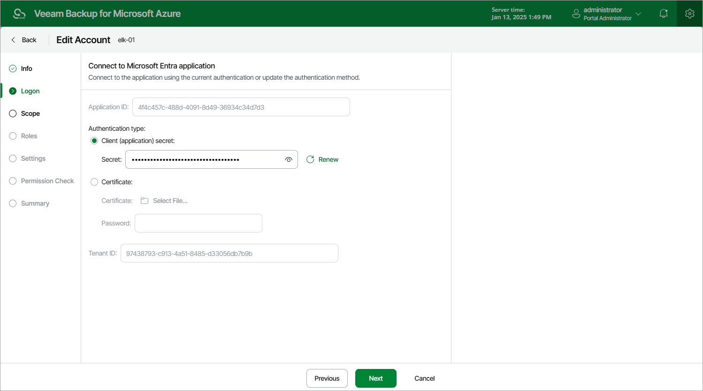

# Step 3. Connect to Microsoft Entra Application

At the Logon step of the wizard, you can review the authentication method that is currently used to connect to the Microsoft Entra application with which the service account is associated. You can also renew a client secret that is about to expire, or associate a new Microsoft Entra application with the service account in case the application that was previously used is no longer available.

Renewing Microsoft Entra Application Secret

To renew a client secret that is about to expire, use either of the following options:

* If you have selected the Specify existing service account option at the Type step of the Add Account wizard, create a new client secret in the specified Microsoft Entra application, enter the secret value in the Secret field and then click Next. To learn how to create client secrets, see [Microsoft Docs](https://docs.microsoft.com/en-us/azure/active-directory/develop/howto-create-service-principal-portal#option-2-create-a-new-application-secret).
* If you have selected the Create service account automatically option at the Type step of the Add Account wizard, do the following:

1. Click Renew next to the Secret field.
2. In the Logon to Microsoft Azure window, click Copy Code to Clipboard and then click https://microsoft.com/devicelogin.
3. On the Microsoft Azure device authentication page, do the following:

1. Paste the code that you have copied and click Next.
2. Select a Microsoft Azure account that will be used to access the Azure CLI. The account must be assigned either the User Access Administrator or the Owner role.

1. Back to the Logon to Microsoft Azure window, check whether any errors occurred during the authentication process and click OK.

Re-creating Microsoft Entra Application

If the Microsoft Entra application that has been used to create the service account is not available or no longer exists in Microsoft Azure, you can create a new Microsoft Entra application that will be associated with the service account. To do that, use either of the following options:

* If you have selected the Create service account automatically option at the Type step of the Add Account wizard, do the following:

1. Click Re-create next to the Application ID field.
2. In the Logon to Microsoft Azure window, click Copy Code to Clipboard and then click https://microsoft.com/devicelogin.
3. On the Microsoft Azure device authentication page, do the following:

1. Paste the code that you have copied and click Next.
2. Select a Microsoft Azure account that will be used to access the Azure CLI. The account must be assigned either the User Access Administrator or the Owner role.

1. Back to the Logon to Microsoft Azure window, check whether any errors occurred during the authentication process and click OK.

* If you have selected the Specify existing service account option at the Type step of the Add Account wizard, provide another Microsoft Entra application:

1. In the Application ID field, enter the application identifier. You can find the identifier on the Overview page of your Microsoft Entra application in the Microsoft Azure portal. For more information, see [Microsoft Docs](https://docs.microsoft.com/en-us/azure/active-directory/develop/howto-create-service-principal-portal#get-values-for-signing-in).
2. Select an application authentication type:

* Select the Client (application) secret option to use a client secret created in the specified Microsoft Entra application. In the Secret field, enter the value of the secret. To learn how to create client secrets, see [Microsoft Docs](https://docs.microsoft.com/en-us/azure/active-directory/develop/howto-create-service-principal-portal#option-2-create-a-new-application-secret).

* Select the Certificate option to use a certificate uploaded to the specified Microsoft Entra application. In the Certificate field, click Select File to locate the certificate. Then, provide a password used to encrypt the certificate in the Password field. To learn how to upload certificates to Microsoft Entra applications, see [Microsoft Docs](https://docs.microsoft.com/en-us/azure/active-directory/develop/howto-create-service-principal-portal#option-1-upload-a-certificate).

|  |
| --- |
| Important |
| Consider the following:   * For Veeam Backup for Microsoft Azure to be able to connect to the specified Microsoft Entra application, the application must be created in Microsoft Azure, and have the Contributor, Key Vault Crypto User and Storage Queue Data Contributor [Azure built-in roles](https://learn.microsoft.com/en-us/azure/role-based-access-control/built-in-roles) assigned. To learn how to create Microsoft Entra applications and assign Azure roles, see [Microsoft Identity Platform](https://docs.microsoft.com/en-us/azure/active-directory/develop/howto-create-service-principal-portal#create-an-azure-active-directory-application) and [Azure RBAC documentation](https://docs.microsoft.com/en-us/azure/role-based-access-control/role-assignments-portal?tabs=current). * Veeam Backup for Microsoft Azure supports certificates only in the formats .PFX and .P12. |

Page updated 2024-09-05

