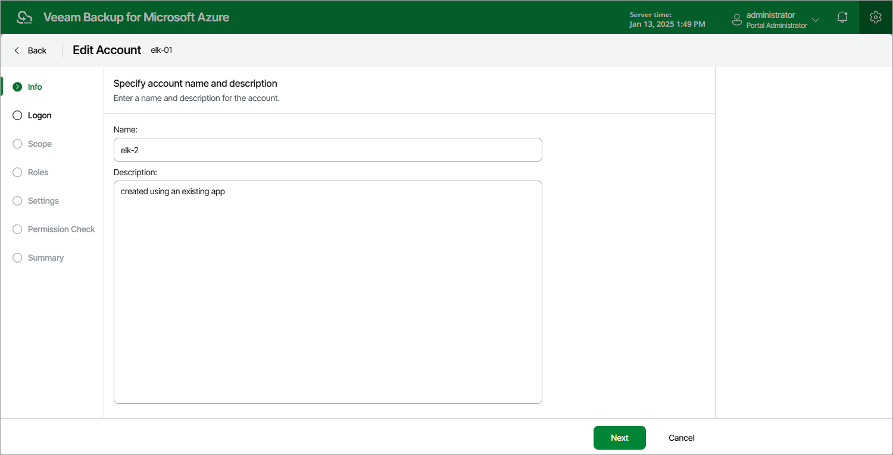

# Step 2. Update Account Info

At the Info step of the wizard, enter a new name and provide a new description for the account.

The maximum length of the name is 255 characters. The following characters are supported: Latin letters, numeric characters, underscores and dashes. The following characters are not supported: / " ' : | < > + = ; , ? \* @ & $ .

Page updated 2026-04-29

