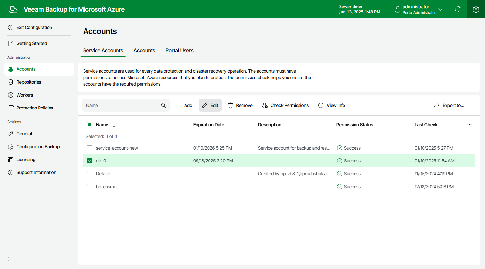

# Step 1. Launch Edit Account Wizard

To launch the Edit Account wizard, do the following:

1. Switch to the Configuration page.
2. Navigate to Accounts > Service Accounts.
3. Select the service account and click Edit.

Page updated 2024-06-17

