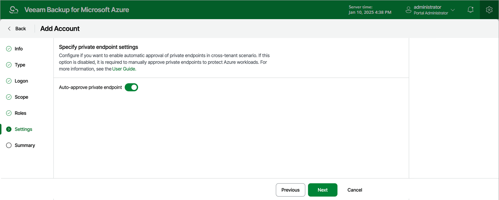

# Step 6. Enable Private Endpoint Approval

If you plan to protect any Azure SQL databases or Cosmos DB accounts that cannot be accessed through a public network, you must allow the backup appliance to create and use private endpoints to protect these databases when creating your backup policies. In case these Azure SQL databases or Cosmos DB accounts belong to Microsoft Entra tenants different than the tenant of your backup appliance, the backup appliance will only be able to create private endpoints with the Pending status, and you will need either to approve them manually as described in [Microsoft Docs](https://learn.microsoft.com/en-us/azure/postgresql/network/how-to-networking-servers-deployed-public-access-approve-private-endpoint?tabs=portal-approve-private-endpoint-connections) or enable automatic endpoint approval for the service account whose permissions you plan to use to access and protect the necessary Azure SQL databases or Cosmos DB accounts.

To enable automatic approval of private endpoints for the service account, set the Auto-approve private endpoint creation toggle to On.

Page updated 2026-08-03

