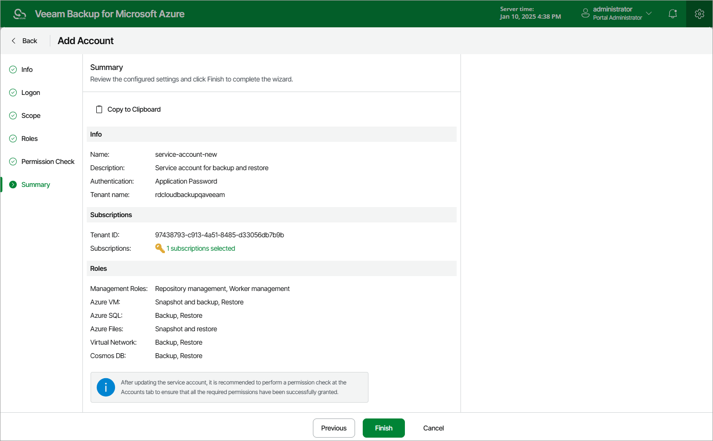

# Step 8. Finish Working with Wizard

At the Summary step of the wizard, review configuration information and click Finish.

|  |
| --- |
| Tip |
| It is recommended that you check whether the account has all the permissions required to perform backup and restore operations. For more information, see [Checking Service Account Permissions](azure_service_account_check.md). |

Page updated 2026-07-28

