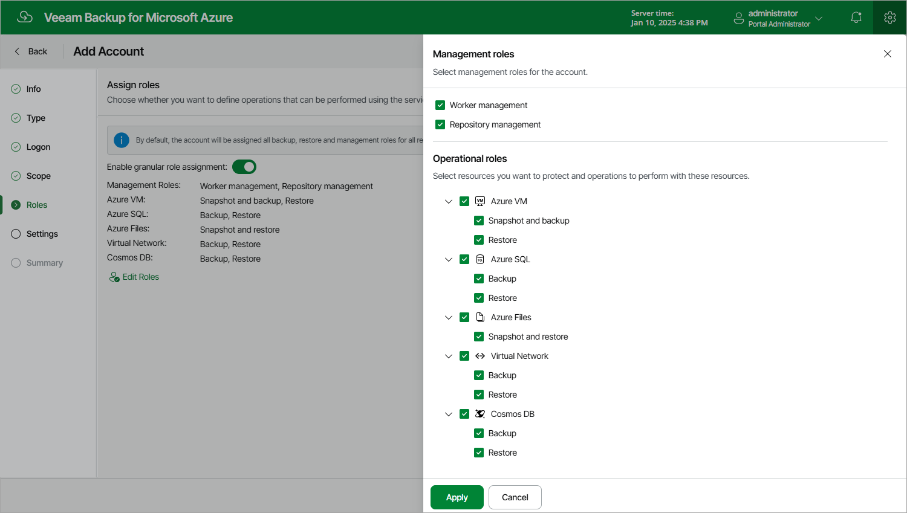

# Step 5. Select Account Roles

At the Roles step of the wizard, you can define specific operations that Veeam Backup for Microsoft Azure will be able to perform using permissions of the service account:

1. Set the Enable granular role assignment toggle to On and click Edit Roles.
2. In the Management roles section, choose actions that will be performed using the service account:

* Worker management — permissions of this service account will be used to launch worker instances. If you create a service account of this type, you will be able to select it [when managing worker configurations](azure_worker_service_account.md).
* Repository management — permissions of this service account will be used to create new repositories in target Azure blob containers and to further access the repositories during data protection and disaster recovery operations. If you create a service account of this type, you will be able to select it [when configuring repository settings](azure_repository_ui_settings.md#Role).

|  |
| --- |
| Important |
| For Veeam Backup for Microsoft Azure to perform the selected actions using the service account, the account must be assigned the permissions listed in sections [Worker Permissions](azure_worker_permissions.md) and [Repository Permissions](azure_repository_permissions.md). |

1. In the Operational roles section, choose resources that will be protected using permissions of the service account, and operations that will be performed with these resources:

* If you select the Backup operation, you will be able to specify the service account when performing [VM backup](azure_backup_chain_vm.md), [SQL backup](azure_how_sql_backup_works.md), [Cosmos DB backup](azure_how_cosmos_db_backup_works.md) and [virtual network configuration backup](azure_how_vnet_backup_works.md).
* If you select the Snapshot operation, you will be able to specify the service account when performing [VM backup](azure_snapshot_chain_vm.md) and [Azure Files backup](azure_how_fs_backup_works.md).
* If you select the Restore operation, you will be able to specify the service account when performing [VM restore](azure_vm_restore_hiw.md), [SQL restore](azure_sql_restore_hiw.md), [file share restore](azure_fs_restore_hiw.md), [Cosmos DB restore](azure_cosmos_db_restore_hiw.md) and [virtual network configuration restore](azure_vnet_restore_hiw.md).

|  |
| --- |
| Important |
| Keep in mind that Veeam Backup for Microsoft Azure does not grant any permissions automatically, unless you have selected the Create service account automatically option at [step 3](azure_service_account_type.md). That is why it is recommended that you check whether the added service account has all the permissions required to perform operations with the selected resources, as described in section [Checking Service Account Permissions](azure_service_account_check.md). |

Page updated 2026-07-28

