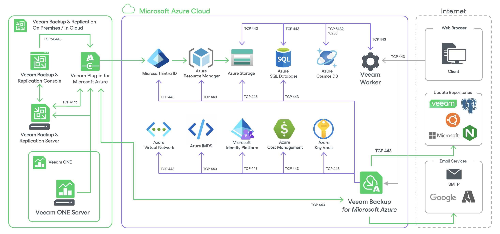

# Azure Services

To perform backup and restore operations in both public and private environments, [Veeam Plug-in for Microsoft Azure](azure_plug_in.md), [backup appliance](azure_backup_appliances.md) and [worker instances](azure_worker_instances.md) must have outbound network access to the following Microsoft Azure services.

Azure Services Required for Veeam Plug-in for Microsoft Azure

* [Microsoft Entra ID](https://learn.microsoft.com/en-us/entra/fundamentals/whatis)
* [Azure Resource Manager](https://docs.microsoft.com/en-us/azure/azure-resource-manager/management/overview)
* [Azure Storage](https://learn.microsoft.com/en-us/azure/storage/common/storage-introduction)

Azure Services Required for Backup Appliance

* [Microsoft Entra ID](https://learn.microsoft.com/en-us/entra/fundamentals/whatis)
* [Azure Cost Management](https://docs.microsoft.com/en-us/azure/cost-management-billing/cost-management-billing-overview)
* [Azure Instance Metadata Service](https://docs.microsoft.com/en-us/azure/virtual-machines/windows/instance-metadata-service?tabs=windows)
* [Azure Key Vault](https://docs.microsoft.com/en-us/azure/key-vault/)
* [Azure Queue Storage](https://learn.microsoft.com/en-us/azure/storage/queues/storage-queues-introduction)
* [Azure Resource Manager](https://docs.microsoft.com/en-us/azure/azure-resource-manager/management/overview)
* [Azure Storage](https://learn.microsoft.com/en-us/azure/storage/common/storage-introduction)
* [Azure Virtual Network](https://learn.microsoft.com/en-us/azure/virtual-network/virtual-networks-overview), for Azure resources that operate in private environments only
* [Microsoft Identity Platform](https://docs.microsoft.com/en-us/azure/active-directory/develop/v2-overview)

Azure Services Required for Worker Instances

* [Azure Storage](https://learn.microsoft.com/en-us/azure/storage/common/storage-introduction)
* [Azure SQL Database](https://learn.microsoft.com/en-us/azure/azure-sql/database/sql-database-paas-overview?view=azuresql)
* [Azure Cosmos DB for PostgreSQL](https://learn.microsoft.com/en-us/azure/cosmos-db/postgresql/introduction)
* [Azure Cosmos DB for MongoDB](https://learn.microsoft.com/en-us/azure/cosmos-db/mongodb/introduction)

|  |
| --- |
| Important |
| Consider the following:   * To allow access to the services, you must open all the required network ports using either Azure network security groups or firewall rules. For the list of required network ports, see [Ports](azure_ports.md). * If your backup appliance used the Azure Service Bus messaging service in versions prior to version 13, you must switch to the Azure Queue Storage service immediately after you upgrade to version 13. Otherwise, Veeam Backup for Microsoft Azure will no longer be able to perform backup and restore operations. For more information, see [Configuring Deployment Mode](azure_deployment_mode.md#messaging). |

Page updated 2025-10-24

