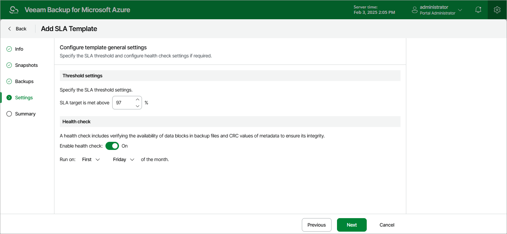

# Step 5. Configure Template General Settings

At the Settings step of the wizard, you can specify SLA threshold settings and schedule health checks for the SLA template.

SLA Threshold Settings

The SLA threshold is a percentage of successfully created restore points out of the total number of restore points expected to be produced by an SLA-based backup policy (97% by default). Based on this percentage, the backup appliance estimates the SLA compliance ratio for all SLA-based backup policies that have this SLA template assigned. For more information, see [How Backup Appliances Estimate SLA Compliance](azure_sla_calculation.md).

Health Check Settings

If you have configured a backup schedule at [step 4](azure_sla_backup_settings.md), you can instruct the backup appliance to periodically perform a health check for backup restore points created by all SLA-based backup policies that have this SLA template assigned. During the health check, the backup appliance performs an availability check for data blocks in the whole regular backup chain, and a cyclic redundancy check (CRC) for metadata to verify its integrity. The health check helps you ensure that the restore points are consistent and that you will be able to restore data using these restore points. For more information on the health check, see [How Health Check Works](azure_sla_how_health_check_works.md).

To instruct the backup appliance to perform a health check, do the following:

1. In the Health check section of the step, set the Enable health check toggle to On.
2. Use the Run on drop-down lists to schedule a specific day for the health check to run.

|  |
| --- |
| Note |
| Veeam Backup for Microsoft Azure performs the health check regardless of the configured backup schedule. By default, the health check runs on a monthly basis — if you want to instruct Veeam Backup for Microsoft Azure to run it on a weekly basis, open a [support case](azure_support_information.md). |

Page updated 2026-07-01

