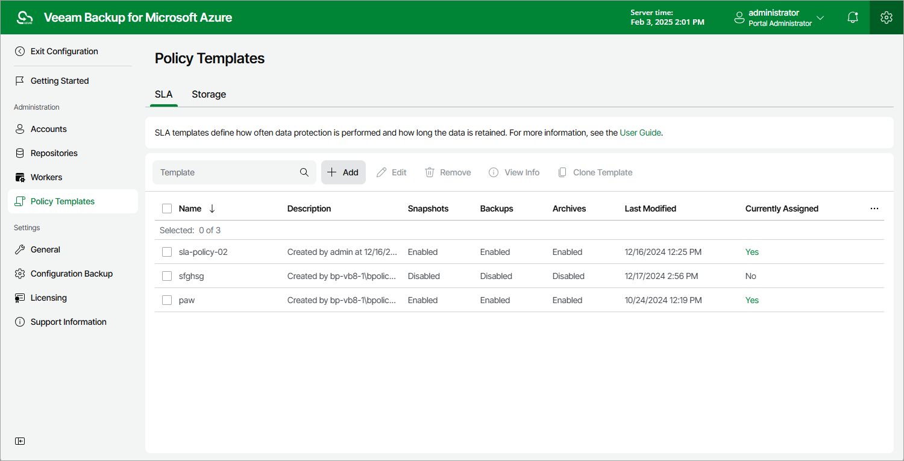

# Step 1. Launch Add SLA Template Wizard

To launch the Add SLA Template wizard, do the following:

1. Switch to the Configuration page.
2. Navigate to Policy Templates > SLA.
3. Click Add.

Page updated 2025-02-06

