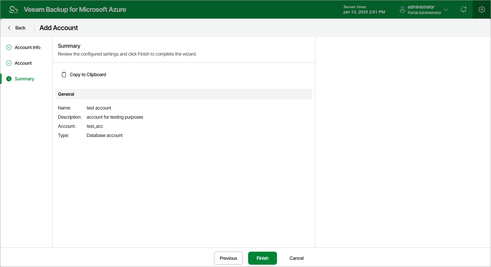

# Step 4. Finish Working with Wizard

At the Summary step of the wizard, review summary information and click Finish.

|  |
| --- |
| TipS |
| * After you add a database account, you will be able to specify this account while creating backup policies and restoring protected resources to allow the backup appliance to access source Azure SQL databases and Cosmos DB for PostgreSQL accounts, as well as to authenticate against target SQL Servers and Cosmos DB for PostgreSQL clusters. For more information, see sections [Performing Backup](azure_backup.md) and [Performing Restore](azure_performing_restore.md).  * After you add an SMTP account, you will be able to specify this account while configuring global notification settings to allow Veeam Backup for Microsoft Azure to send backup policy results and daily reports. For more information, see [Configuring Global Notification Settings](azure_configuring_notification_settings.md). |

Page updated 2026-07-01

