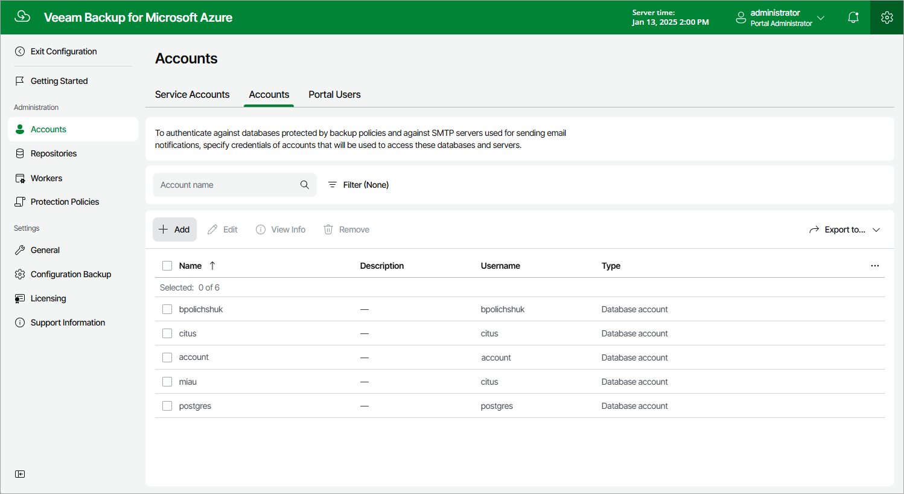

# Step 1. Launch Add Account Wizard

To launch the Add Account wizard, do the following:

1. Switch to the Configuration page.
2. Navigate to Accounts > Accounts.
3. Click Add.

Page updated 2024-06-12

