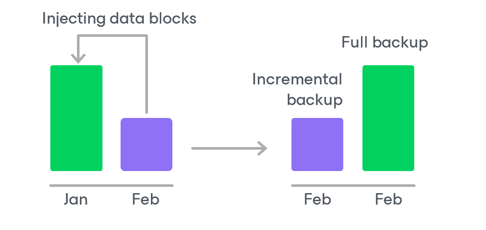
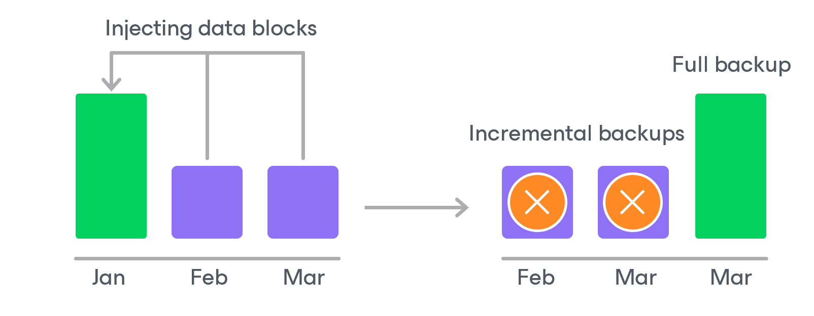

# Retention Policy for Archived Backups

For archived backups, backup appliances retain restore points for the number of days defined in backup scheduling settings as described in section [Creating SQL Backup Policies](azure_sql_backup_policy_schedule.md).

To track and remove outdated restore points from an archive backup chain, the backup appliance performs the following actions once a day:

1. The backup appliance checks the configuration database to detect archive backup repositories that contain outdated restore points.
2. If an outdated restore point exists in a repository, the backup appliance transforms the archive backup chain in the following way:

1. The backup appliance rebuilds the full archive backup to include in it data of the incremental archive backup that follows the full archive backup. To do that, the appliance injects into the full archive backup data blocks from the earliest incremental archive backup in the chain. This way, the full archive backup ‘moves’ forward in the archive backup chain.

1. The backup appliance removes the earliest incremental archive backup from the chain as redundant — this data has already been injected into the full archive backup.

1. The backup appliance repeats step 2 for all other outdated restore points found in the archive backup chain until all the restore points are removed. As data from multiple restore points is injected into the rebuilt full archive backup, the appliance ensures that the archive backup chain is not broken and that you will be able to recover your data when needed.

Page updated 2026-07-01

