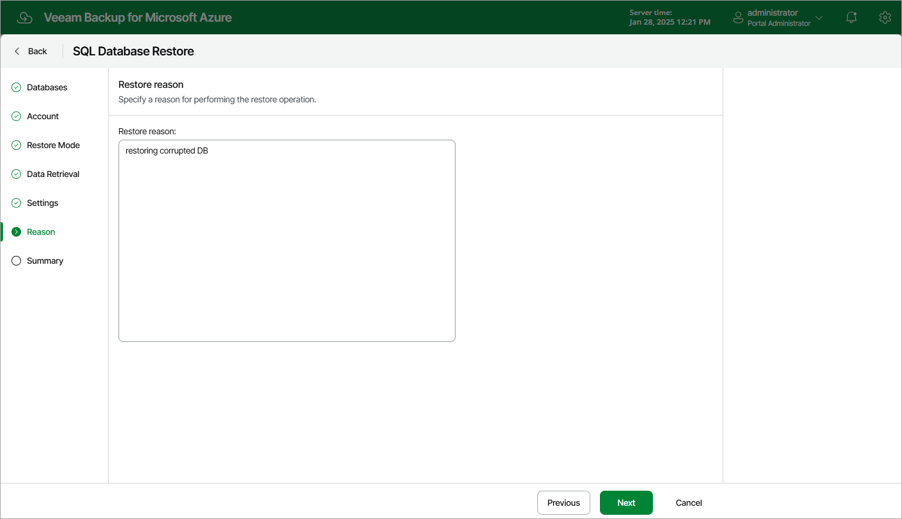

# Step 8. Specify Restore Reason

At the Reason step of the wizard, specify a reason for restoring the Azure SQL database. This information will be saved to the session history, and you will be able to reference it later.

Page updated 2025-01-28

