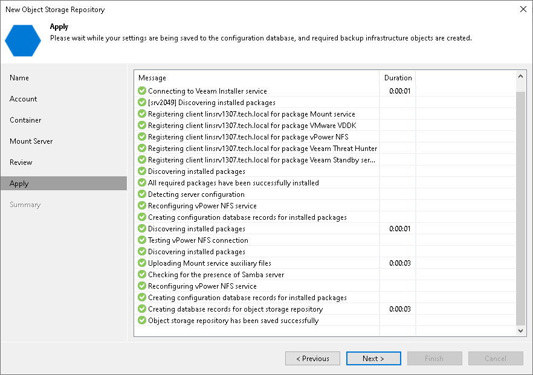

# Step 7. Apply Settings

In this article

At the Apply step of the wizard, wait for Veeam Backup & Replication to complete saving your settings to the configuration database and create backup infrastructure objects.

Page updated 10/17/2023

Page content applies to build 13.0.1.1071
