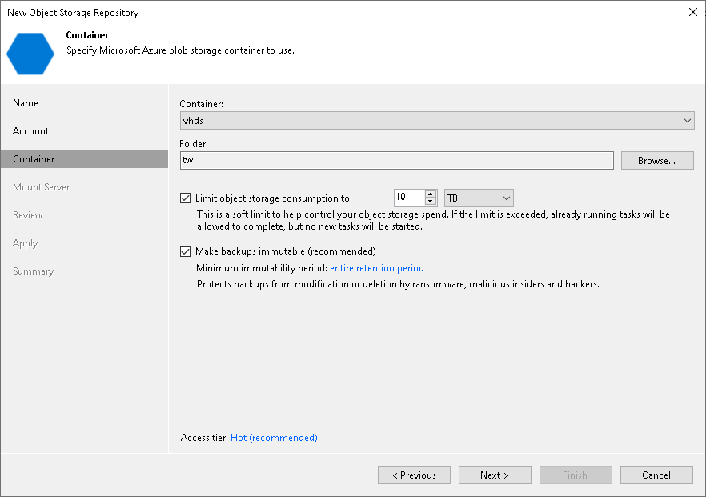
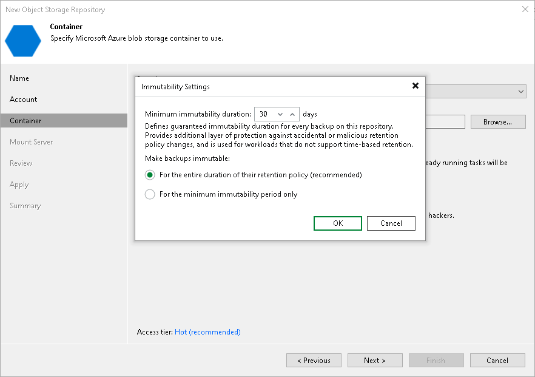
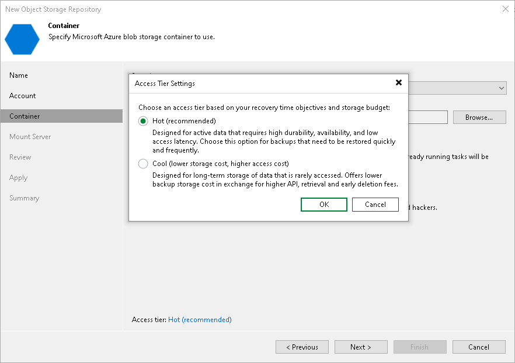

# Step 4. Specify Object Storage Settings

At the Container step of the wizard, specify the container, the folder that will be used to store data and select an access tier in which Veeam Backup & Replication will keep blobs. For more information on access tiers, see [Microsoft Docs](https://learn.microsoft.com/en-us/azure/storage/blobs/access-tiers-overview).

1. From the Container drop-down list, select a container.

Make sure that the container where you want to store your backup data was created in advance.

|  |
| --- |
| Note |
| The default Root container is not supported. For more information about this container, see [Microsoft Docs](https://docs.microsoft.com/en-us/rest/api/storageservices/working-with-the-root-container). |

1. To the right of the Folder field, click Browse and either select an existing folder or click New Folder.

1. Select the Limit object storage consumption to check box to define a soft limit for your object storage consumption. If this limit is exceeded during a job run, Veeam Backup & Replication will complete the job. However, a new job will not be able to start unless you remove the extra data that exceeds the limit or change the soft limit settings. Provide the value in TB or PB.

Specifying Immutability Settings

To prohibit deletion of blocks of data from object storage, select the Make recent backups immutable (recommended) check box. In the Immutability Settings window, specify how the immutability period is counted and set the immutability period in days:

* Select For the entire duration of their retention policy if you want the immutability period depend on the retention policy of a backup job.

|  |
| --- |
| Important |
| Consider the following:   * If the job retention exceeds the immutability period, the actual retention is counted as job retention policy + Block Generation period. * If the immutability period exceeds the job retention period, the actual retention is counted as immutability period + Block Generation period.   For more information, see [How Immutability Works](hiw_immutability_os.md), |

* Select For the minimum immutability period only if you want to specify the immutability period explicitly. The backup job retention will be skipped.
* Next to the Minimum immutability duration option, provide the necessary value.

Specifying Azure Access Tier Settings

To specify the access tier that you want assign to data blocks that you keep in Azure Blob object storage, click the Hot link to the right of the Access tier field. In the Access Tier Settings window, select one of the following:

* Select the Hot option to assign the Hot access tier to data blocks. Use this option if you plan to access your data frequently and store it for a short period of time.
* Select the Cool option to assign the Cool access tier the Hot tier to data blocks. Use this option if you plan to access your data rarely (for example, once in a month or less) and plan to store data at least for 30 days.

|  |
| --- |
| Important |
| Consider the following:   * If you select the Cool option and plan to use this object storage as a performance or capacity tier, do not target to this repository any jobs that constantly send backup data to this storage: scheduled regular backup and backup copy jobs that run without GFS, jobs with transactions logs enabled, jobs created by [Veeam Plug-Ins for Enterprise Applications](protect_applications.md). Otherwise, it will result in higher costs. * Azure Blob storage may apply a different access tier to your backup data and metadata than the settings specified in Veeam Backup & Replication, if your Azure storage account access tier differs from those set in Veeam Backup & Replication. For more information, see [Azure Storage Access Tier Considerations](azure_limitations.md#accesstier). |

