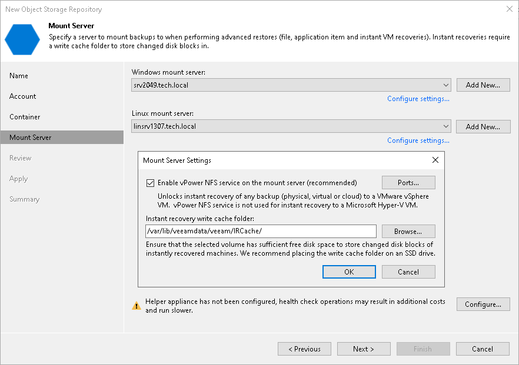
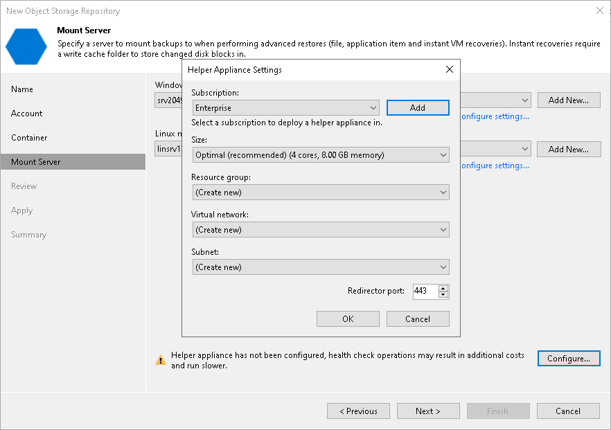

# Step 5. Specify Mount Server Settings

At the Mount Server step of the wizard, do the following.

* [Specify mount server settings](#mount).
* [Configure a helper appliance](#helper).

Specifying Mount Server Settings

The mount server is a component that Veeam Backup & Replication uses for restore operations. For more information, see [Mount Servers](mount_server.md).

To specify mount server settings, do the following:

1. From the Windows mount server list, select a Microsoft Windows server that you want to use as a mount server. The Windows mount server list contains only Microsoft Windows servers added to the backup infrastructure. If the server is not added to the backup infrastructure yet, click Add New on the right to open the New Windows Server wizard. For more information, see [Adding Microsoft Windows Servers](add_windows_server.md).
2. From the Linux mount server list, select a Linux server that you want to use as a mount server. The Linux mount server list contains only RHEL/Rocky-based Linux servers added to the backup infrastructure and Veeam Software Appliance. If the server is not added to the backup infrastructure yet, click Add New on the right to open the New Linux Server wizard. For more information, see [Adding Linux Servers](add_linux_server.md).
3. Click Configure settings to configure other settings for the selected mount servers:

1. Select the Enable vPower NFS service on the mount server check box to allow the Veeam vPower NFS Service access the object storage repository. Veeam Backup & Replication will enable the Veeam vPower NFS Service on the necessary mount server. For more information, see [Veeam vPower NFS Service](vpower_nfs_service.md).

|  |
| --- |
| Important |
| Consider the following:   * vPower NFS settings are not applicable in Microsoft Hyper-V environments. * Do not enable Microsoft Windows NFS services on the machine where you install the Veeam vPower NFS Service. If Microsoft NFS services and Veeam vPower NFS Service are enabled on the same machine, both services may fail to work correctly. |

1. Click Ports to customize network ports used by the Veeam vPower NFS Service. In the vPower NFS Port Settings window, specify the following settings:

* Next to the Mount Port section, specify the port that the Veeam vPower NFS Service will use to mount the vPower NFS datastore to the ESXi host.
* Next to the vPower NFS port section, specify the port that the Veeam vPower NFS Service will use to connect to the target NFS share.

For information on ports used by default, see [Ports](used_ports.md).

1. In the Instant recovery write cache folder field, specify a folder to keep cache that is created during mount operations

Configuring Helper Appliance

A helper appliance is a temporary host that Veeam Backup & Replication deploys on your Microsoft Azure Blob storage to perform a health check of backup files and apply retention to unstructured data backup files. For more information, see [Health Check for Object Storage Repositories](health_check_os.md) and [Helper Appliance in Unstructured Data Backup](unstructured_data_backup_in_object_storage.md#helper). After Veeam Backup & Replication completes these operations, it removes the helper appliance from the Microsoft Azure Blob storage.

To configure the helper appliance, at the Mount Server step, click Configure and in the Helper Appliance Settings window, specify the following settings:

1. From the Subscription drop-down list, select your Microsoft Azure subscription credentials.

If you have not set up credentials beforehand, click Add. You will be prompted to the [Specify Microsoft Azure Compute Account Name](restore_azure_acc_name.md) wizard. Follow the wizard to add your account. Before adding your Microsoft Azure account, check the [prerequisites](restore_azure_accounts.md#add_azure_account_perequisites).

1. From the Size drop-down list, select the size of the helper appliance.
2. From the Resource group drop-down list, select a resource group that will be associated with the helper appliance.

To be able to select the necessary resource group from the drop-down list, you must create it beforehand as described in the [Microsoft Docs.](https://docs.microsoft.com/en-us/azure/azure-resource-manager/management/manage-resource-groups-portal#create-resource-groups)

1. From the Virtual network drop-down list, select a network to which the helper appliance must be connected.

To be able to select the necessary network from the drop-down list, you must create it beforehand as described in the [Microsoft Docs.](https://docs.microsoft.com/en-us/azure/virtual-network/manage-virtual-network)

|  |
| --- |
| Important |
| Veeam Backup & Replication creates a default network security group within a virtual network with the inbound rules that allow connection using the 443 and 22 ports from everywhere (0.0.0.0/0). |

1. From the Subnet drop-down list, select a subnet for the helper appliance.

To be able to select the necessary subnet from the drop-down list, you must create it beforehand as described in the [Microsoft Docs.](https://docs.microsoft.com/en-us/azure/virtual-network/virtual-network-manage-subnet)

1. In the Redirector port field, specify the port that Veeam Backup & Replication will use to route requests between the helper appliance and backup infrastructure components.

