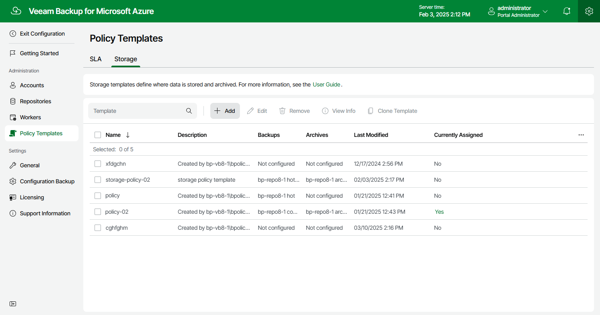

# Step 1. Launch Add Storage Template Wizard

To launch the Add Storage Template wizard, do the following:

1. Switch to the Configuration page.
2. Navigate to Policy Templates > Storage.
3. Click Add.

Page updated 2025-03-31

